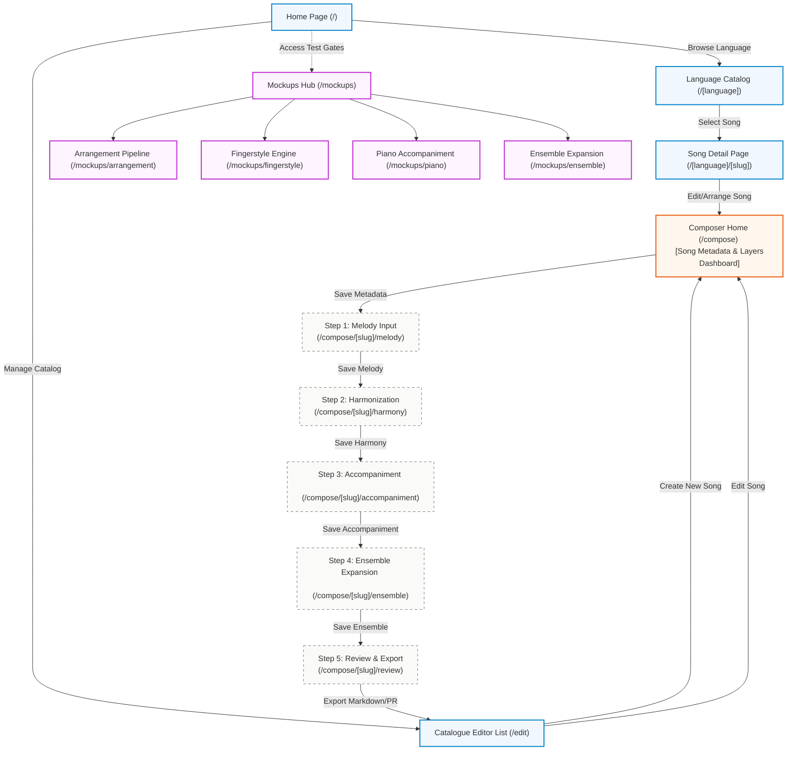
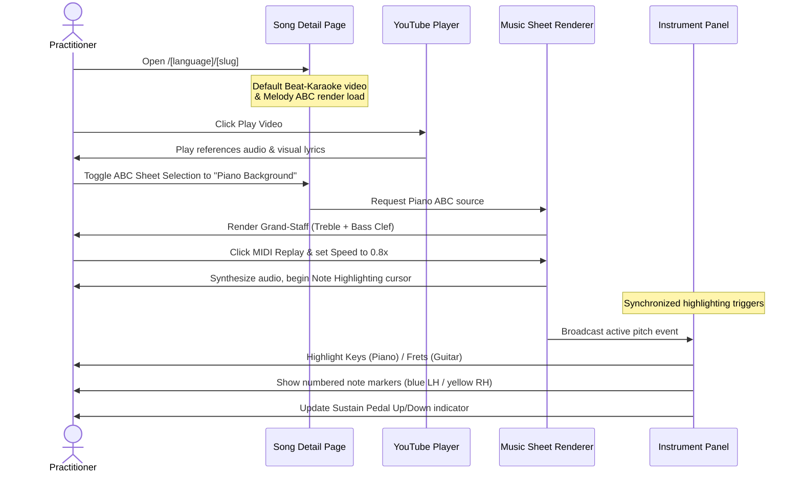
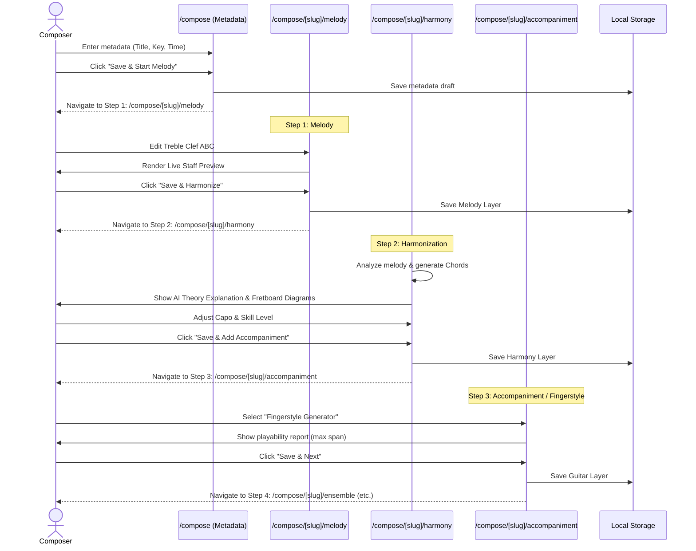
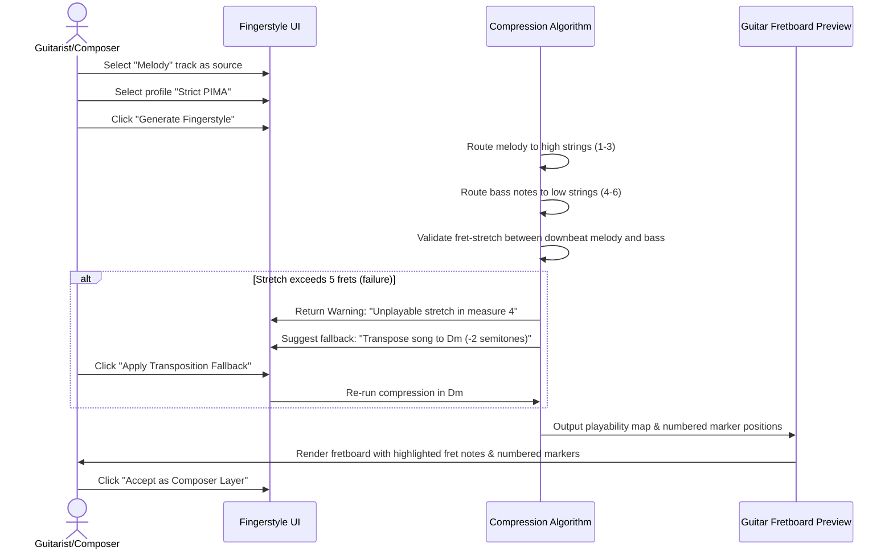

# Bhajan Song Composer — User Interface Specification

This document details the user interface (UI) architecture, layout structure, screen connectivity, and user experience flows for the **Bhajan Song Composer** web application. 

It is designed to satisfy the playback and composition requirements outlined in [PRD.md](file:///Users/steve/duyhunghd6/bhajan-song-composer/docs/PRD.md) and technical stages in [PLAN.md](file:///Users/steve/duyhunghd6/bhajan-song-composer/docs/PLAN.md).

---

## 1. Application Navigation Graph

The application follows a clean, responsive web flow divided into three primary zones: the **Playback Hub**, the **Composer Workstation**, and the **Mockup / PoC Gates** (for isolated testing of agentic AI workflows).



---

## 2. Page Layout Architectures

### 2.1 Song Playback Page Layout
The playback screen is optimized for double-medium split playback: users can watch video-based reference material or interact with dynamic, MIDI-synthesized sheet music.

```
+----------------------------------------------------------------------------------+
| Navigation: Home / [Language] / [Song Title]                                     |
+----------------------------------------------------------------------------------+
|                                                                                  |
|  +-------------------------------------+  +-----------------------------------+  |
|  |           YouTube Player            |  |      Lyrics & Transliteration     |  |
|  |                                     |  |                                   |  |
|  |  [Type: Beat-Karaoke / Performance] |  |  Verse 1...                       |  |
|  |                                     |  |  Chorus...                        |  |
|  +-------------------------------------+  +-----------------------------------+  |
|                                                                                  |
|  +----------------------------------------------------------------------------+  |
|  |                      ABCJS Music Sheet Render Panel                        |  |
|  |  [Sheet Selector: Melody / Backing / Piano]                                |  |
|  |  [Controls: Play, Pause, Tempo-Scale, Loop-Range]                           |  |
|  |                                                                            |  |
|  |  ======================== STAFF RENDER AREA =============================  |  |
|  |  [Note Highlighting Cursor synchronizes with MIDI Playback]                |  |
|  +----------------------------------------------------------------------------+  |
|                                                                                  |
|  +----------------------------------------------------------------------------+  |
|  |                     Visual Instrument Highlight Panel                      |  |
|  |  [Layout Toggles: Guitar Fretboard Mode / Piano Keyboard Mode]             |  |
|  |                                                                            |  |
|  |  [Numbered Note Markers: blue left hand / yellow right hand]              |  |
|  |  [Sustain Pedal Indicator: Up / Down] (For Piano mode)                     |  |
|  +----------------------------------------------------------------------------+  |
+----------------------------------------------------------------------------------+
```

### 2.2 Workstation Route-Based Layout (The 5 Child-UIs)

To prevent UI clutter and to empower **Agentic AI Coding**, the Composer Workstation is **strictly split into 5 smaller, dedicated child-UIs** using Next.js subroutes (`/compose/[slug]/[step]`). 

A monolithic screen containing all these features would be an anti-pattern. By decoupling the pipeline into distinct routes, each UI is small, state is localized, and AI agents can reason about one workflow at a time. The 20% width Sidebar remains consistent across all routes, showing step progress and layer status.

#### 2.2.1 Step 1: Melody Input (`/compose/[slug]/melody`)
Focus: Inputting the foundational Treble Clef ABC notation.

```
+-----------------------+----------------------------------------------------------+
|  SIDEBAR (20%)        |  MAIN WORKSPACE CANVAS: STEP 1 - MELODY (80%)            |
|                       |                                                          |
|  [✓] Metadata         |  +----------------------------------------------------+  |
|  [▶] 1. Melody        |  | ABC Notation Editor (Text Area)                    |  |
|  [ ] 2. Harmony       |  | X:1 ... K:C ... C D E F | G A B c |                |  |
|  [ ] 3. Accompaniment |  +----------------------------------------------------+  |
|  [ ] 4. Ensemble      |  +----------------------------------------------------+  |
|  [ ] 5. Review        |  | Live ABCJS Render Preview                          |  |
|                       |  | ===================== STAFF ====================== |  |
|  [Track States]       |  +----------------------------------------------------+  |
|                       |  [ Back ]                            [ Save & Next ]     |
+-----------------------+----------------------------------------------------------+
```

#### 2.2.2 Step 2: Harmonization (`/compose/[slug]/harmony`)
Focus: AI Theory Assistant generating chord progressions.

```
+-----------------------+----------------------------------------------------------+
|  SIDEBAR (20%)        |  MAIN WORKSPACE CANVAS: STEP 2 - HARMONIZATION (80%)     |
|                       |                                                          |
|  [✓] 1. Melody        |  +----------------------------------------------------+  |
|  [▶] 2. Harmony       |  | AI Analysis Settings: [Detect Key] [Set Raga]      |  |
|  [ ] 3. Accompaniment |  | [ Generate Chord Progression ]                     |  |
|                       |  +----------------------------------------------------+  |
|  [Track States]       |  +----------------------------------------------------+  |
|  Melody (Background)  |  | AI Theory Explanation Box                          |  |
|                       |  | "Using the natural minor scale, the iv-VII..."     |  |
|                       |  +----------------------------------------------------+  |
|                       |  +----------------------------------------------------+  |
|                       |  | Chord Track Editor (Ghosted Melody below)          |  |
|                       |  | [ Am ]   [ G ]   [ F ]   [ E7 ]                    |  |
|                       |  +----------------------------------------------------+  |
|                       |  [ Back ]                            [ Save & Next ]     |
+-----------------------+----------------------------------------------------------+
```
*(Note: Ghosted Background Layers allow the user to see the Melody notes faintly behind the active Chord track).*

#### 2.2.3 Step 3: Accompaniment (`/compose/[slug]/accompaniment`)
Focus: Generating Piano Accompaniment or Guitar Fingerstyle from the Harmonized Melody.

```
+-----------------------+----------------------------------------------------------+
|  SIDEBAR (20%)        |  MAIN WORKSPACE CANVAS: STEP 3 - ACCOMPANIMENT (80%)     |
|                       |                                                          |
|  [✓] 2. Harmony       |  +----------------------------------------------------+  |
|  [▶] 3. Accompaniment |  | Engine Toggle: (o) Piano Accomp. ( ) Fingerstyle   |  |
|  [ ] 4. Ensemble      |  | Profile: [Pop/Ballad] [Rock/R&B] [Classical/Folk]  |  |
|                       |  | [ Generate Accompaniment Matrix ]                  |  |
|                       |  +----------------------------------------------------+  |
|  [Track States]       |  +----------------------------------------------------+  |
|  Melody (Background)  |  | Playability Validation Report                      |  |
|  Harmony (Background) |  | ⚠️ "Max span exceeded in m.4. Converted to arpeggio"|  |
|                       |  +----------------------------------------------------+  |
|                       |  +----------------------------------------------------+  |
|                       |  | Resulting ABC Staff Preview (Bass & Treble Clefs)  |  |
|                       |  +----------------------------------------------------+  |
|                       |  [ Back ]                            [ Save & Next ]     |
+-----------------------+----------------------------------------------------------+
```

#### 2.2.4 Step 4: Ensemble Expansion (`/compose/[slug]/ensemble`)
Focus: Layering Flute, Violin, and Djembe on top of the accompaniment.

```
+-----------------------+----------------------------------------------------------+
|  SIDEBAR (20%)        |  MAIN WORKSPACE CANVAS: STEP 4 - ENSEMBLE (80%)          |
|                       |                                                          |
|  [✓] 3. Accompaniment |  +----------------------------------------------------+  |
|  [▶] 4. Ensemble      |  | Enable Layers: [x] Djembe  [x] Flute  [ ] Violin   |  |
|  [ ] 5. Review        |  | [ Generate Ensemble Support ]                      |  |
|                       |  +----------------------------------------------------+  |
|  [Track States]       |  +----------------------------------------------------+  |
|  (All Background)     |  | Conflict Resolution Hierarchy Log                  |  |
|                       |  | "Flute yielded in m.8 due to active melody..."     |  |
|                       |  +----------------------------------------------------+  |
|                       |  +----------------------------------------------------+  |
|                       |  | Multi-track ABCJS Render (Full Score View)         |  |
|                       |  +----------------------------------------------------+  |
|                       |  [ Back ]                            [ Save & Next ]     |
+-----------------------+----------------------------------------------------------+
```

#### 2.2.5 Step 5: Review & Export (`/compose/[slug]/review`)
Focus: Reviewing the final multi-layer arrangement and exporting to markdown for a Pull Request.

```
+-----------------------+----------------------------------------------------------+
|  SIDEBAR (20%)        |  MAIN WORKSPACE CANVAS: STEP 5 - REVIEW & EXPORT (80%)   |
|                       |                                                          |
|  [✓] 4. Ensemble      |  +----------------------------------------------------+  |
|  [▶] 5. Review        |  | Playback Simulation: Test Full Audio & Sync        |  |
|                       |  | [ Play All Layers ]                                |  |
|                       |  +----------------------------------------------------+  |
|                       |  +----------------------------------------------------+  |
|  [Track States]       |  | Raw Markdown Output File Preview                   |  |
|  All Layers Active    |  | ---                                                |  |
|                       |  | title: "..."                                       |  |
|                       |  | abcNotations: [...]                                |  |
|                       |  | ---                                                |  |
|                       |  | ## Lyrics ...                                      |  |
|                       |  +----------------------------------------------------+  |
|                       |  [ Back ]      [ Copy Markdown ]   [ Submit as PR ]      |
+-----------------------+----------------------------------------------------------+
```

---

## 3. Core User Experience Flows

### 3.1 Flow 1: Playback & Practice Flow (Learner/Practitioner)
This flow guides a practitioner through finding, listening to, and learning chords or finger placements for a devotional song.



---

### 3.2 Flow 2: Composition & Upward Construction Flow (Composer)
This flow details how a composer moves chronologically through the arrangement pipeline, passing through the dedicated child-UIs.



---

### 3.3 Flow 3: Fingerstyle Compression & Playability Tuning
This flow highlights the interaction between the downward compression algorithm and the user setting physical constraints, specifically on the `/compose/[slug]/accompaniment` or `/mockups/fingerstyle` page.



---

## 4. Layout States and Responsiveness Guidelines

1. **Desktop View (>= 1024px)**: 
   - Grid layout is strictly `20% / 80%` column split for the Workstation child-UIs.
   - The Layer Stack Preview displays horizontally below the two columns.
2. **Tablet View (768px - 1023px)**:
   - Grid changes to `30% / 70%` column split to prevent the sidebar from being too compressed.
   - Textareas in the ABC Editor scale down font sizes to `text-xs` for clarity.
3. **Mobile View (< 768px)**:
   - The grid collapses into a single vertical stack.
   - The Sidebar transforms into a slide-over/drawer or a collapsible accordion block at the top of the screen labeled "Layers & Navigation".
   - Input fields and textareas occupy `100%` viewport width.
   - Fretboard and Keyboard SVGs enable horizontal scrolling (`overflow-x-auto`) to keep key grids readable.
