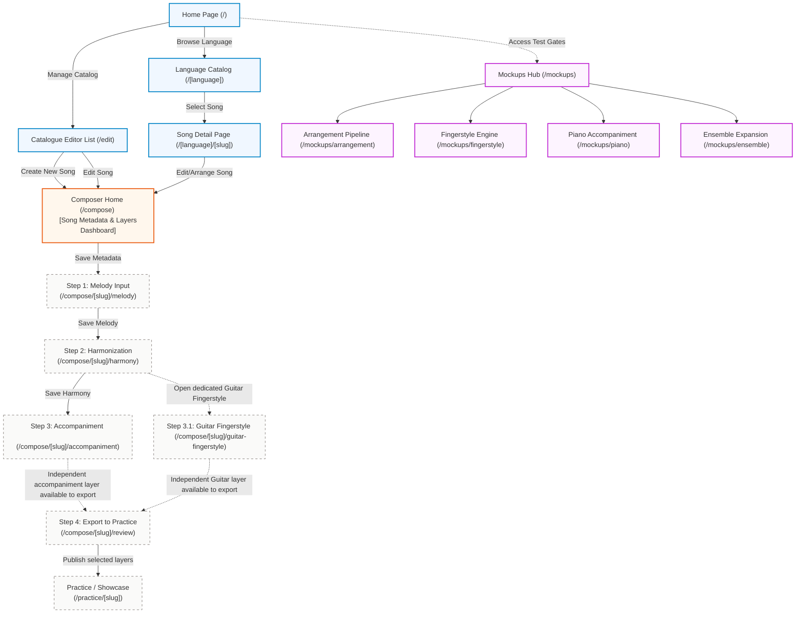
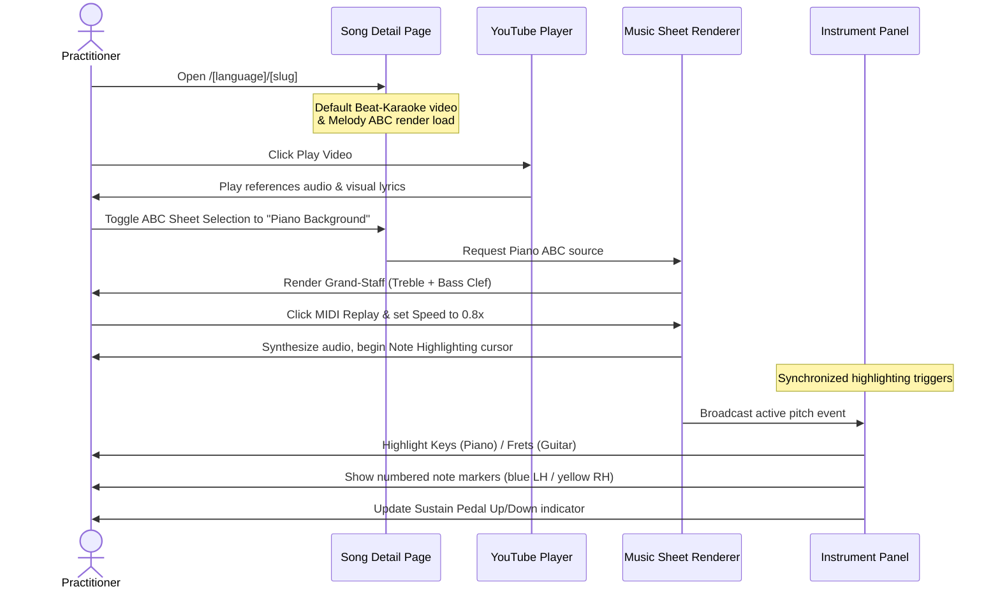
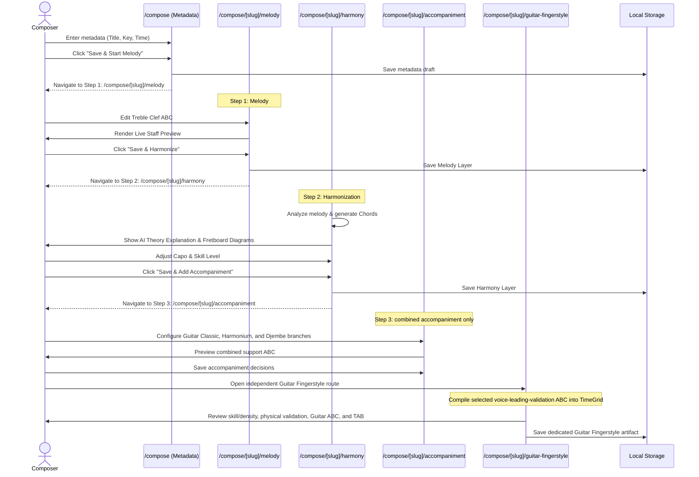
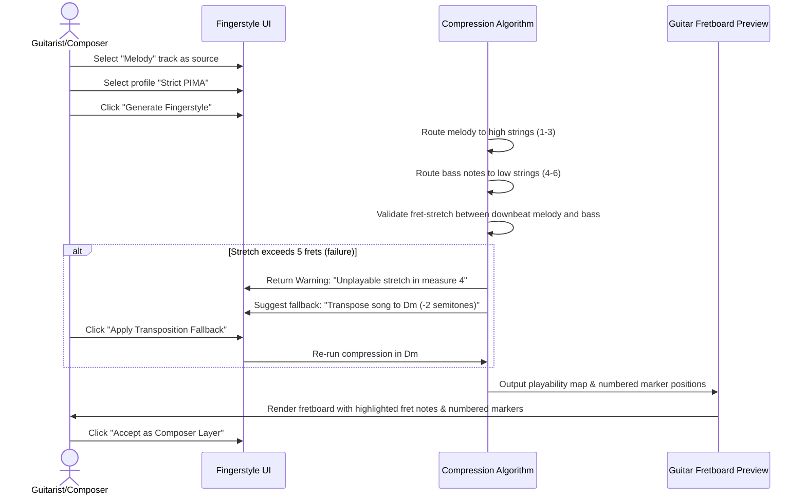

# Bhajan Song Composer — User Interface Specification

This document details the user interface (UI) architecture, layout structure, screen connectivity, and user experience flows for the **Bhajan Song Composer** web application. 

It is designed to satisfy the playback and composition requirements outlined in [PRD.md](file:///Users/steve/duyhunghd6/bhajan-song-composer/docs/PRD.md) and technical stages in [PLAN.md](file:///Users/steve/duyhunghd6/bhajan-song-composer/docs/PLAN.md).

---

## 1. Application Navigation Graph

The application follows a clean, responsive web flow divided into three primary zones: the **Playback Hub**, the **Composer Workstation**, and the **Mockup / PoC Gates** (for isolated testing of agentic AI workflows).



---

## 2. Page Layout Architectures

### 2.1 Song Playback Page Layout
The playback screen is optimized for double-medium split playback: users can watch video-based reference material or interact with dynamic, MIDI-synthesized sheet music.

```
+----------------------------------------------------------------------------------+
| Navigation: Home / [Language] / [Song Title]                                     |
+----------------------------------------------------------------------------------+
|                                                                                  |
|  +-------------------------------------+  +-----------------------------------+  |
|  |           YouTube Player            |  |      Lyrics & Transliteration     |  |
|  |                                     |  |                                   |  |
|  |  [Type: Beat-Karaoke / Performance] |  |  Verse 1...                       |  |
|  |                                     |  |  Chorus...                        |  |
|  +-------------------------------------+  +-----------------------------------+  |
|                                                                                  |
|  +----------------------------------------------------------------------------+  |
|  |         Universal ABCJS Playback Controller (Reusable Component)           |  |
|  |  [Sheet Selector: Melody / Backing / Piano]                                |  |
|  |  [Controls: Play, Stop, BPM Control, Measure X->Y Select, Loop]            |  |
|  |                                                                            |  |
|  |  ======================== STAFF RENDER AREA =============================  |  |
|  |  [Note Highlighting Cursor synchronizes with MIDI Playback]                |  |
|  +----------------------------------------------------------------------------+  |
|                                                                                  |
|  +----------------------------------------------------------------------------+  |
|  |                     Visual Instrument Highlight Panel                      |  |
|  |  [Layout Toggles: Guitar Fretboard Mode / Piano Keyboard Mode]             |  |
|  |                                                                            |  |
|  |  [Numbered Note Markers: blue left hand / yellow right hand]              |  |
|  |  [Sustain Pedal Indicator: Up / Down] (For Piano mode)                     |  |
|  +----------------------------------------------------------------------------+  |
+----------------------------------------------------------------------------------+
```

### 2.2 Workstation Route-Based Layout

To prevent UI clutter and to empower **Agentic AI Coding**, the Composer Workstation is split into dedicated child-UIs using Next.js subroutes (`/compose/[slug]/[step]`). The dedicated Guitar Fingerstyle route is a sibling downstream of Harmony rather than an accompaniment substep.

A monolithic screen containing all these features would be an anti-pattern. By decoupling the pipeline into distinct routes, each UI is small, state is localized, and AI agents can reason about one workflow at a time. The Workstation uses a compact checkpoint strip for Layers & Navigation so step progress remains visible without consuming the left side of the canvas.

#### 2.2.1 Step 1: Melody Input (`/compose/[slug]/melody`)
Focus: Inputting the foundational Treble Clef ABC notation.

```
+----------------------------------------------------------------------------------+
| COMPACT CHECKPOINTS: [✓] Metadata  [▶] Melody  [ ] Harmony  [ ] Accomp  [ ] Review|
+----------------------------------------------------------------------------------+
| MAIN WORKSPACE CANVAS: STEP 1 - MELODY                                           |
|                                                                                  |
| QHD / very wide viewport:                                                        |
|  +--------------------------------------+  +------------------------------------+ |
|  | ABC Notation Editor (Text Area)      |  | Music Staff Playback              | |
|  | X:1 ... K:C ... C D E F | G A B c | |  | [Play/Stop, BPM, Measure Loop]    | |
|  |                                      |  | ===== bounded STAFF viewport ==== | |
|  |                                      |  | internal scroll if score is tall  | |
|  +--------------------------------------+  +------------------------------------+ |
|                                                                                  |
| Laptop / tablet / narrow viewport:                                               |
|  +----------------------------------------------------------------------------+  |
|  | ABC Notation Editor (top)                                                |  |
|  +----------------------------------------------------------------------------+  |
|  +----------------------------------------------------------------------------+  |
|  | Music Staff Playback (bottom, bounded width/height + internal scroll)    |  |
|  +----------------------------------------------------------------------------+  |
|                                                                                  |
| [ Back ]                                                        [ Save & Next ]  |
+----------------------------------------------------------------------------------+
```

#### 2.2.2 Step 2: Harmonization (`/compose/[slug]/harmony`)
Focus: AI Theory Assistant generating chord progressions and refining them with a real-time preview and virtual instruments.

```
+----------------------------------------------------------------------------------+
| COMPACT CHECKPOINTS: [✓] Metadata  [✓] Melody  [▶] Harmony  [ ] Accomp  [ ] Review|
+----------------------------------------------------------------------------------+
| MAIN WORKSPACE CANVAS: STEP 2 - HARMONIZATION                                    |
|                                                                                  |
| STACK 1: AI Analysis & Preview (Two-column grid)                                 |
|  +------------------------------------+  +------------------------------------+  |
|  | AI Analysis Settings               |  | Harmonization Preview              |  |
|  | [Detect Key] [Set Raga]            |  | [Music Staff Playback]             |  |
|  | [✨ Suggest AI Harmonization]      |  |                                    |  |
|  |                                    |  +------------------------------------+  |
|  | Theory Assistant                   |  | Current ABCNotation of the Song    |  |
|  | [Accept Arrangement]               |  | X:1 ... C D E F | G A B c |        |  |
|  +------------------------------------+  +------------------------------------+  |
|                                                                                  |
| STACK 2: Composer Notes & Editing (Two-column grid)                              |
|  +------------------------------------+  +------------------------------------+  |
|  | Composer Layer Note                |  | Chord Track Editor                 |  |
|  | "Pop Progression accepted as the   |  | (Ghosted Melody below)             |  |
|  | harmony layer."                    |  | [ Am ]   [ G ]   [ F ]   [ E7 ]    |  |
|  +------------------------------------+  +------------------------------------+  |
|                                                                                  |
| STACK 3: Virtual Instruments (Full width)                                        |
|  +----------------------------------------------------------------------------+  |
|  | Piano Voicing Keyboard                                                     |  |
|  | [============= KEYS & NOTE HIGHLIGHTING ===============]                     |  |
|  +----------------------------------------------------------------------------+  |
|  | Guitar Fretboard preview                                                   |  |
|  | [============== FRETS & STRING MARKERS ===============]                     |  |
|  +----------------------------------------------------------------------------+  |
|                                                                                  |
| [ Back ]                                                        [ Save & Next ]  |
+----------------------------------------------------------------------------------+
```
*(Note: Ghosted Background Layers allow the user to see the Melody notes faintly behind the active Chord track).*

#### 2.2.3 Step 3: Accompaniment (`/compose/[slug]/accompaniment`)
Focus: combined accompaniment planning from the selected Harmony Step 3 (`voice-leading-validation`) ABC.

```
+----------------------------------------------------------------------------------+
| COMPACT CHECKPOINTS: [✓] Metadata  [✓] Melody  [✓] Harmony  [▶] Accomp  [ ] Review|
+----------------------------------------------------------------------------------+
| MAIN WORKSPACE CANVAS: STEP 3 - ACCOMPANIMENT                                    |
|                                                                                  |
| Ordered stack: [x] Guitar Classic  [x] Indian Harmonium  [x] Djembe             |
| Shared Harmony review: Key & Beats → Chords → Validate Harmony                   |
| Instrument branches: Guitar comping/voicing/ABC · Harmonium · Djembe             |
|                                                                                  |
|  +------------------------------------+  +------------------------------------+  |
|  | AI Accompaniment Workflow          |  | Resulting ABC Staff Preview        |  |
|  | [Generate / review branch options] |  | [Music Staff Playback]             |  |
|  | No Solo/Fingerstyle or TAB output  |  | Guitar Classic standard staff +     |  |
|  |                                    |  | combined support voices             |  |
|  +------------------------------------+  +------------------------------------+  |
+----------------------------------------------------------------------------------+
```

#### 2.2.4 Dedicated Guitar Fingerstyle (`/compose/[slug]/guitar-fingerstyle`)

This independent sibling route compiles the selected `voice-leading-validation` ABC into the meter-aware TimeGrid. It owns skill and fill-density settings, physical validation, generated Guitar ABC, and ASCII-GuitarTab; it never consumes accompaniment output.

#### 2.2.5 Step 4: Export to Practice (`/compose/[slug]/review`)

Export is the durable handoff from Composer drafts to Practice (the only Showcase). It lists source-current Melody, Validated Harmony, Accompaniment, and Guitar Fingerstyle layers. The user selects exactly which layers to publish; unselected notation files and the Markdown Lyrics/Notes body remain unchanged.

```
+-----------------------------------+------------------------------------------+
| EXPORT SELECTOR                   | ARRANGEMENT PREVIEW                      |
| [ ] Melody                        | [ ABCJS playback ]                       |
| [ ] Validated Harmony             | Preview may combine valid draft branches |
| [ ] Accompaniment                 |                                          |
| [ ] Guitar Fingerstyle            |                                          |
| [ Publish selected layers ]       | [ Open Practice after publication ]      |
+-----------------------------------+------------------------------------------+
```

> Ensemble remains a mockup/experimental workflow and has no Composer route in the active product flow.

### 2.3 Reusable Shared Components

#### 2.3.1 Universal ABCJS Playback Controller
To maintain consistency across the Playback Hub, Composer Workstation, and Mockup Gates, the music rendering and playback controls must be abstracted into a single, highly reusable React component (e.g., `<AbcjsPlaybackController />`).

**Features & Capabilities:**
- **Rendering Engine:** Uses `abcjs` to render raw ABC notation into responsive SVG staves.
- **Playback Controls:** 
  - **Start / Stop:** Toggle MIDI synthesis and audio playback.
  - **BPM Control:** Slider or input to speed up or slow down the tempo.
  - **Measurement Selection:** UI inputs to select a specific measure range (from Measure X to Measure Y).
  - **Looping:** Toggle to continuously loop the selected measurement range.
- **Portability:** Any page requiring music display or playback (Song Detail Page, Step 1 Melody Editor, Mockups, etc.) simply imports and mounts this component, passing the ABC string and playback constraints as props.

---

## 3. Core User Experience Flows

### 3.1 Flow 1: Playback & Practice Flow (Learner/Practitioner)
This flow guides a practitioner through finding, listening to, and learning chords or finger placements for a devotional song.



---

### 3.2 Flow 2: Composition & Upward Construction Flow (Composer)
This flow details how a composer moves chronologically through the arrangement pipeline, passing through the dedicated child-UIs.



---

### 3.3 Flow 3: Dedicated Guitar Fingerstyle Compression & Playability Tuning
This flow highlights the interaction between the downward compression algorithm and physical constraints on `/compose/[slug]/guitar-fingerstyle`. The route independently starts from the selected `voice-leading-validation` ABC; `/compose/[slug]/accompaniment` output is not an input.



---

## 4. Layout States and Responsiveness Guidelines

1. **Desktop View (>= 1024px)**:
   - Workstation child-UIs use a compact top checkpoint strip for Layers & Navigation instead of a persistent 20% sidebar, keeping the main canvas readable.
   - The checkpoint strip shows one-line progress for Metadata plus the five composer steps, highlighting complete, current, and pending states.
   - Standard desktop and laptop widths keep the ABC Editor stacked above the Music Staff Playback when horizontal space would make either panel cramped.
2. **Very Wide / QHD View (extra-wide canvas, e.g. >= 1536px)**:
   - Step 1 Melody may split the main canvas into two readable panels: ABC Notation Editor on the left and Music Staff Playback on the right.
   - The Music Staff Playback must use a bounded width and height, with internal scrolling when needed, so abcjs does not stretch the first line too wide to read.
   - ABCJS render options should prefer wrapped staff systems, typically around four measures per line, so the user can read at least the first page or first half-page comfortably.
3. **Tablet View (768px - 1023px)**:
   - Composer content stays as a single-column flow: ABC source on top, Music Staff Playback below.
   - Textareas in the ABC Editor scale down font sizes to `text-xs` for clarity where needed.
4. **Mobile View (< 768px)**:
   - The grid collapses into a single vertical stack.
   - Layers & Navigation remains a compact checkpoint block at the top rather than a sidebar or tall drawer.
   - Input fields and textareas occupy `100%` viewport width.
   - Music staff, Fretboard, and Keyboard SVGs enable horizontal scrolling (`overflow-x-auto`) to keep notation and key grids readable.
