# Accompaniment Workflow Guide
<!-- beads-id: br-guide-accompaniment-workflow -->

This guide is the source of truth for the **human-in-the-loop accompaniment workflow** hosted on `/compose/:slug/accompaniment`. It explains the shared harmony steps, the per-instrument branches, dynamic step gating, and the rules every step must respect. The underlying arpeggiation theory (in Vietnamese) is in [Guitar Arpeggiation Theory](../theory/guitar-arpeggiation-theory.md); the directed source flow that feeds this workflow is in [Composer Source Flow](./composer-source-flow.md).

Step ids, labels, dependencies, and enabled-branch planning are defined in code at `src/lib/theory/accompaniment-workflow/definition.ts`. When that file changes, update this guide in the same change.

## 1. Setup and instrument stack
<!-- beads-id: br-guide-accompaniment-workflow-s01 -->

Before small-step generation, the wizard captures the setup defined in `definition.ts`:

- Ordered instrument stack: **Guitar Classic**, **Indian Harmonium**, **Djembe**.
- Role hints derive from stack order: bottom/foundation instruments bias bass, drone, and transient support; middle instruments bias comping and sustained support; top instruments bias light rhythmic color.
- New and restored workflows use combined `accompaniment` mode with all three instruments enabled. Legacy persisted Solo/Fingerstyle setup values normalize to this mode; persisted removed-instrument selections are discarded during normalization.
- Setup is persisted before session start. Once a workflow begins, the normalized setup is embedded in `AccompanimentWorkflowSession` so prompt generation, visible steps, and next-step traversal share one source of truth.

## 2. Pipeline overview

```mermaid
flowchart TD
    A["Input: Melody ABC (with optional [Chord] lyric annotations), key, meter"] --> B

    subgraph "Shared harmony steps (always enabled)"
        B["Step 1: key-beats"]
        B --> C["Step 2: chord-roles-progression"]
        C --> D["Step 3: voice-leading-validation"]
    end

    D --> G
    subgraph "Guitar Classic branch"
        G["Step 4: guitar-comping-profile"]
        G --> H["Step 5: guitar-voicing-bass"]
        H --> I["Step 6: guitar-classic-abc-notation"]
    end

    D --> M
    subgraph "Harmonium branch"
        M["Step 7: harmonium-drone-register"]
        M --> N["Step 8: harmonium-chord-voicing-validation"]
    end

    D --> P
    subgraph "Djembe branch"
        P["Step 9: djembe-groove-interlock"]
        P --> Q["Step 10: djembe-fill-validation"]
    end

    I --> K["V:GuitarSupport standard-notation support voice"]
    D -.->|independent sibling route| J["/compose/:slug/guitar-fingerstyle"]
```

<!-- beads-id: br-guide-accompaniment-workflow-s02 -->



The selected Step 3 result is the only harmonic source for every branch and for the independent Guitar Fingerstyle route. Accompaniment output never feeds Fingerstyle.

## 3. Shared harmony steps (Steps 1–3)
<!-- beads-id: br-guide-accompaniment-workflow-s03 -->

These steps are shared with `/compose/:slug/harmony` and are always enabled.

On `/compose/:slug/harmony` the shared steps are expected to stay small and reviewable, in this order:

1. Detect or confirm key, scale/raga context, and meter.
2. Identify strong-beat targets and cadence points.
3. Generate multiple harmonization candidates (never a single opaque result).
4. Let the user select or accept one candidate per step.
5. Preview the exact Step 3 ABC that will feed the Accompaniment and Guitar Fingerstyle branches.

Harmony work preserves the source melody unless the task explicitly asks for melody editing.

### Step 1 — `key-beats`
<!-- beads-id: br-guide-accompaniment-workflow-s04 -->

Confirm key, scale/raga context, phrase endings, cadence targets, and strong-beat emphasis.

- In 4/4, beat 1 is very strong, beat 3 is medium, beats 2 and 4 are weak. Melody notes on strong beats should be chord tones (root, 3rd, 5th); weak beats may carry passing, neighbor, or suspension tones.
- Example for a song in `K:Em`: E natural minor (E–F#–G–A–B–C–D), relative major G, diatonic chords i Em, ii° F#dim, III G, iv Am, v Bm, VI C, VII D. Typical cadences: `Am → Em` (iv–i), `D → Em` (VII–i), `Bm → Em` (v–i).

### Step 2 — `chord-roles-progression`
<!-- beads-id: br-guide-accompaniment-workflow-s05 -->

Map each strong-beat melody note to possible chord-tone roles, choose a progression, and produce harmonized ABC.

- Embedded `[Chord]` symbols in lyric `w:` lines are treated as user-supplied progression context.
- For devotional bhajans in Em, the simplest candidate (`Em → Am → D → Em`, i–iv–VII–i) is usually preferred: meditative, and every chord has an open guitar voicing. Alternatives such as `Em → G → Am → D` or `Em → C → G → D` are offered as further candidates.

### Step 3 — `voice-leading-validation`
<!-- beads-id: br-guide-accompaniment-workflow-s06 -->

Smooth chord transitions and validate the harmonized ABC: common tones stay in place, other voices move by the shortest path, no parallel fifths/octaves, the melody is preserved exactly, and beat counts/pitch alignment are validated. The user-selected Step 3 ABC becomes the downstream source.

## 4. Guitar Classic branch (Steps 4–6)
<!-- beads-id: br-guide-accompaniment-workflow-s07 -->

The Guitar Classic branch produces a **singer-support standard-notation voice**, never a solo Fingerstyle artifact and never Guitar TAB as an ABC layer.

### Step 4 — `guitar-comping-profile`
<!-- beads-id: br-guide-accompaniment-workflow-s08 -->

Choose the realization technique from `GUITAR_CLASSIC_COMPING_PROFILE_IDS`:

| Profile id | Technique | Typical use |
|---|---|---|
| `devotional-pima-arpeggio` | arpeggio | Slow, meditative bhajans; P-I-M-A-M-I flow |
| `devotional-pinch-arpeggio` | pinch | Bass+treble pinch on strong beats, arpeggio between |
| `bhajan-strum` | strum | Energetic call-and-response; multi-string groups |

Each candidate carries a representative, physically validated one-guitar sample.

### Step 5 — `guitar-voicing-bass`
<!-- beads-id: br-guide-accompaniment-workflow-s09 -->

Plan open/barre voicings and bounded bass anchors that one guitarist can fret, with meter-grid event durations.

- **Bass line protocol:** root at the start of each chord window; root or fifth on the next stable beat only if the treble-led texture is kept; an optional short-step approach note on the last weak subdivision only before a real chord change; never more than two consecutive bass-only onsets except at intentional transitions/cadences.
- **Guide tones:** prefer the 3rd and 7th of each chord when arpeggiating before repeating root/fifth.
- Guitar tab validation steps must provide concrete tab events with one-based measure, grid step, duration, beat, note, string, fret, and role.

Reference open voicings (standard tuning): Em `0-2-2-0-0-0`, Am `x-0-2-2-1-0`, D `x-x-0-2-3-2`, G `3-2-0-0-0-3`, C `x-3-2-0-1-0`, Bm `x-2-4-4-3-2`.

### Step 6 — `guitar-classic-abc-notation`
<!-- beads-id: br-guide-accompaniment-workflow-s10 -->

Deterministically materialize the selected Step 4 profile and Step 5 anchors, together with the Step 3 harmony, into a complete chord-driven, measure-aligned `V:GuitarSupport clef=treble-8` voice (MIDI program 24). This is done by `accompaniment-workflow/guitar-classic-realization.ts` and `guitar-classic-abc.ts`, not by another model call.

- Step 6 is **not** a copy of sparse bass anchors: PIMA/pinch profiles arpeggiate chord tones on the grid; strum profiles create simultaneous multi-string groups. Root/fifth anchors alone must never be treated as the completed accompaniment.
- Singer-support policy: strings 6–5–4 carry 30–45% of individual-note attacks (root, fifth, approach), strings 3–2–1 carry 55–70% (arpeggio, guide tones, color). A pinch counts one bass and one treble attack and requires one string from 4–6 and one from 1–3; pinches occur only on metric strong beats. Ratios are evaluated over the whole realized voice, not per measure.
- In split bars, each chord window rearticulates its own root/voicing context; the previous harmony does not sustain across the chord change except for a valid intentional common tone.
- Validated physical strings may render an optional GuitarSupport TAB staff at render time, but that render feature never feeds Fingerstyle.

## 5. Harmonium branch (Steps 7–8)
<!-- beads-id: br-guide-accompaniment-workflow-s11 -->

- `harmonium-drone-register` — choose devotional drone tones, register lane, bellows-like sustain density, and melody-yield behavior.
- `harmonium-chord-voicing-validation` — validate chord voicings, root-fifth drones, sustain windows, and collision-safe sustained support that does not cover the melody.

## 6. Djembe branch (Steps 9–10)
<!-- beads-id: br-guide-accompaniment-workflow-s12 -->

- `djembe-groove-interlock` — choose a groove profile and interlock Bass/Tone/Slap strokes with accompaniment transients.
- `djembe-fill-validation` — choose fill policy, backbeat/slap behavior, and transient conflict limits. After this step is selected, `accompaniment-workflow/support-layers.ts` adapts the decisions into a playable Djembe support layer for the preview.

## 7. Dynamic step gating
<!-- beads-id: br-guide-accompaniment-workflow-s13 -->

- Shared Steps 1–3 are always enabled.
- Combined `accompaniment` enables branch steps only for enabled instruments in the ordered stack. Disabled instrument branches must not appear, block completion, or be required before the accompaniment result is applied.
- The planned step grid must react whenever a retained instrument checkbox changes, including after a workflow has started: newly checked instruments add their branch steps; unchecked instruments remove theirs and must not block completion.
- Disabled branches must not block `getNextUncompletedWorkflowStepId` or step unlock checks.
- The whole wizard lives on the single existing route `/compose/:slug/accompaniment` (`src/app/compose/[slug]/[step]/`). Internal substeps are persisted workflow state, not route segments: do not add a separate route for accompaniment substeps unless a task explicitly requests deep links.
- The Guitar Classic branch may render its support ABC layer after `guitar-classic-abc-notation` is selected; the Djembe branch after `djembe-fill-validation` is selected.

## 8. Rules every step must respect
<!-- beads-id: br-guide-accompaniment-workflow-s14 -->

- Preserve the melody ABC exactly unless the specific step allows chord annotations.
- Do not collapse small steps into one opaque generation unless the user explicitly requests it.
- Keep generated ABC previewable with `AbcjsPlaybackController`.
- For multi-instrument ABC, preserve Melody visual line breaks and group by staff system: `[V:Melody]` line N, then each Guitar/Harmonium/Djembe line N for the same measure range, before moving to line N+1.
- Chord-tone validation (warning-level, non-blocking): generated support notes are expected to belong to the chord annotated for that measure under the current key signature. The chord-tone reference table is injected into the prompt and `validateGuitarVoiceChordTones()` in `src/lib/theory/chord-tone-reference.ts` reports out-of-chord notes as warnings rather than rejecting the step result (see [Guitar Arpeggiation Theory § Phần VI](../theory/guitar-arpeggiation-theory.md)).
- Fill density is a Guitar Fingerstyle generation setting, not an accompaniment workflow setting.

## 9. Checklist
<!-- beads-id: br-guide-accompaniment-workflow-s15 -->

```text
□ 1. Confirm key, scale, cadence, and strong-beat notes
□ 2. Map melody notes → chord roles; choose a progression
□ 3. Validate voice leading; user selects the Step 3 ABC
  ────── shared steps done ──────
□ 4. Choose Guitar Classic comping profile (PIMA / pinch / strum)
□ 5. Plan voicing map + bass anchors with grid timing/duration
□ 6. Deterministically realize V:GuitarSupport standard notation (no TAB layer)
□ 7–8. Harmonium drone/register → chord voicing validation (if enabled)
□ 9–10. Djembe groove interlock → fill validation (if enabled)
  ────── accompaniment branches done ──────
□ [Sibling route] /compose/:slug/guitar-fingerstyle consumes the Step 3 ABC directly
```

## 10. Code references
<!-- beads-id: br-guide-accompaniment-workflow-s16 -->

| Concern | Symbol | File |
|---|---|---|
| Shared step ids | `ACCOMPANIMENT_WORKFLOW_SHARED_STEP_IDS` | `src/lib/theory/accompaniment-workflow/definition.ts` |
| Guitar / Harmonium / Djembe step ids | `ACCOMPANIMENT_WORKFLOW_GUITAR_STEP_IDS`, `..._HARMONIUM_STEP_IDS`, `..._DJEMBE_STEP_IDS` | `src/lib/theory/accompaniment-workflow/definition.ts` |
| Comping profiles | `GUITAR_CLASSIC_COMPING_PROFILE_IDS` | `src/lib/theory/accompaniment-workflow/definition.ts` |
| Guitar Classic realization | — | `src/lib/theory/accompaniment-workflow/guitar-classic-realization.ts`, `guitar-classic-abc.ts` |
| Session transitions | — | `src/lib/theory/accompaniment-workflow/session-transitions.ts` |
| Djembe support layer | — | `src/lib/theory/accompaniment-workflow/support-layers.ts` |
| LLM tool schemas | — | `src/lib/theory/accompaniment-workflow/tool-schema.ts` |
| Chord-tone reference | `buildChordToneReferenceTable`, `validateGuitarVoiceChordTones` | `src/lib/theory/chord-tone-reference.ts` |
| Public workflow entrypoint | — | `src/lib/theory/accompaniment-workflow.ts` |
| Server actions | — | `src/app/actions/accompaniment-workflow.ts` |
| Step UI | `AccompanimentStep` | `src/components/composer/workspace/AccompanimentStep.tsx` |
| Wizard controller | `AccompanimentWorkflowWizard` | `src/components/composer/AccompanimentWorkflowWizard.tsx` |
| Setup panel / wizard parts | — | `src/components/composer/accompaniment-workflow/WorkflowSetupPanel.tsx`, `wizard-parts.tsx` |
| Guitar theory (skill) | — | `.claude/skills/music-theory-arrangement/ARRANGEMENT01-GUITAR.md` |
| Music theory foundation (skill) | — | `.claude/skills/music-theory-arrangement/THEORY.md` |

Related: [Guitar Fingerstyle Arrangement Guide](./guitar-fingerstyle-arrangement-guide.md) for the independent solo-guitar sibling branch.
