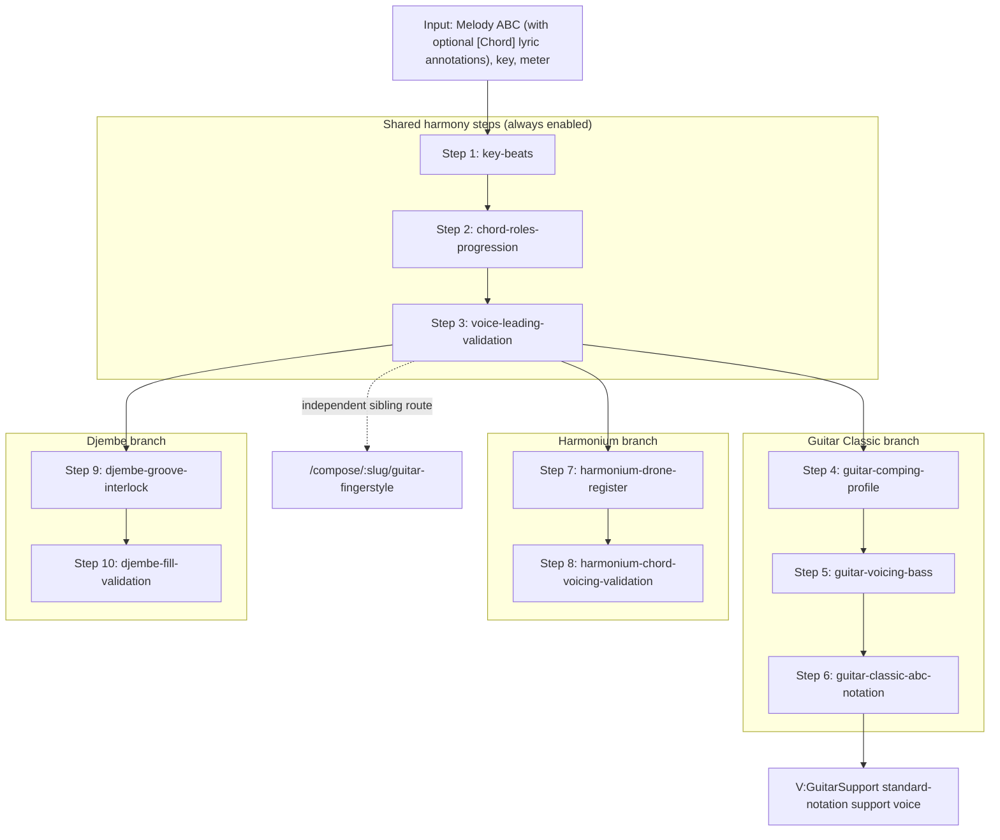

# Accompaniment Workflow Guide
<!-- beads-id: br-guide-accompaniment-workflow | satisfies: br-prd01-s60 -->

This guide is the source of truth for the **human-in-the-loop accompaniment workflow** hosted on `/compose/:slug/accompaniment`. It explains the shared harmony steps, the per-instrument branches, dynamic step gating, and the rules every step must respect. The underlying arpeggiation theory (in Vietnamese) is in [Guitar Arpeggiation Theory](../theory/guitar-arpeggiation-theory.md); the directed source flow that feeds this workflow is in [Composer Source Flow](./composer-source-flow.md).

Step ids, labels, dependencies, and enabled-branch planning are defined in code at `src/lib/theory/accompaniment-workflow/definition.ts`. When that file changes, update this guide in the same change.

## 1. Setup and instrument stack
<!-- beads-id: br-guide-accompaniment-workflow-s01 -->

Before small-step generation, the wizard captures the setup defined in `definition.ts`:

- Ordered instrument stack: **Guitar Classic**, **Indian Harmonium**, **Djembe**.
- Role hints derive from stack order: bottom/foundation instruments bias bass, drone, and transient support; middle instruments bias comping and sustained support; top instruments bias light rhythmic color.
- New and restored workflows use combined `accompaniment` mode with all three instruments enabled. Legacy persisted Solo/Fingerstyle setup values normalize to this mode; persisted removed-instrument selections are discarded during normalization.
- Setup is persisted before session start. Once a workflow begins, the normalized setup is embedded in `AccompanimentWorkflowSession` so prompt generation, visible steps, and next-step traversal share one source of truth.

## 2. Pipeline overview
<!-- beads-id: br-guide-accompaniment-workflow-s02 -->



The selected Step 3 result is the only harmonic source for every branch and for the independent Guitar Fingerstyle route. Accompaniment output never feeds Fingerstyle.

## 2A. Singer-accompaniment decision model
<!-- beads-id: br-guide-accompaniment-workflow-s17 | satisfies: br-prd01-s62 -->

For singer accompaniment, distinguish three independent controls: (1) the locked beat/subdivision `chord windows`, (2) the comping profile (`điệu đệm`, not melody), and (3) the voicing plan. The first is source fact; the latter two can be changed independently, but both remain constrained by the source meter, phrase boundaries, singer activity/register, player skill, and instrument physics.

The normal order is source facts → meter-compatible profile shortlist → section-level voicing plan → realization/validation. A profile catalog must filter incompatible meter families before an LLM ranks options. A voicing plan must retain a fretboard/register area across a phrase unless a register conflict, cadence/color lift, or physical constraint warrants a change. See [Singer-Accompaniment Decision Model](./singer-accompaniment-decision-model.md) for the canonical facts, Guitar/Piano policies, and LLM contract.

## 3. Shared harmony steps (Steps 1–3)
<!-- beads-id: br-guide-accompaniment-workflow-s03 -->

These steps are shared with `/compose/:slug/harmony` and are always enabled. All three run locally through `src/lib/theory/harmony/workflow.ts`; they never invoke the LLM transport or require AI credentials. The wizard hides prompt input and LLM activity for these steps. Each result still requires explicit selection; lyric chords do not bypass Step 2 selection.

On `/compose/:slug/harmony` the shared steps are expected to stay small and reviewable, in this order:

1. Detect or confirm key, scale/raga context, and meter.
2. Identify strong-beat targets and cadence points.
3. Generate multiple harmonization candidates (never a single opaque result).
4. Let the user select or accept one candidate per step.
5. Preview the exact Step 3 ABC that will feed the Accompaniment and Guitar Fingerstyle branches.

Harmony work preserves the source melody unless the task explicitly asks for melody editing.

### Step 1 — `key-beats`
<!-- beads-id: br-guide-accompaniment-workflow-s04 -->

Confirm the explicit ABC key/mode and meter, inspect exact metric accents and pickup timing, and choose primary/secondary pulses or downbeat emphasis. Phrase-end candidates are the final bar and bars ending in rests; these are heuristics, not inferred raga or tala identities. The ABC key is authoritative.

- In 4/4, beat 1 is very strong, beat 3 is medium, beats 2 and 4 are weak. Melody notes on strong beats should be chord tones (root, 3rd, 5th); weak beats may carry passing, neighbor, or suspension tones.
- Example for a song in `K:Em`: E natural minor (E–F#–G–A–B–C–D), relative major G, diatonic chords i Em, ii° F#dim, III G, iv Am, v Bm, VI C, VII D. Typical cadences: `Am → Em` (iv–i), `D → Em` (VII–i), `Bm → Em` (v–i).

Harmony automatically processes **Strong Beats** and **Missing Chord** through their Layers & volume checkboxes; there are no separate analysis/fill buttons. `src/lib/theory/harmony/metric-timeline.ts` parses the Melody voice (first voice when unnamed) with abcjs into JSON measures/events, retaining original character offsets and whole-note timing. It accounts for `L:`, rests, tuplets, broken rhythm, bracket pitches, key/bar accidentals, ties, line continuations and meter changes at bar boundaries. An initial short bar is treated as a right-aligned pickup. The analysis samples sounding pitches, including sustains, at metric targets: 1/3 in 4/4, 1 in triple/simple duple, each dotted pulse in compound meter, and explicit additive group starts. Ungrouped odd meters use the downbeat only; free/unsupported meters and mid-bar key/meter changes require manual input. Beat labels count denominator units (6/8 targets are 1 and 4). These are metric accents, not inferred performance accents or a tala detector.

`src/lib/theory/harmony/auto-chords.ts` ranks diatonic triads by strong-beat pitch compatibility and duration-weighted melody coverage, with small tonic, IV/V and prior-chord preferences suitable for the devotional context. It retains three ranked alternatives in the result for callers. One annotation is inserted at the first event of each chordless sounding measure; every existing character, chord (including N.C.), lyric, repeat and other voice stays unchanged. Silent bars and irregular interior/overfull bars are skipped with a visible explanation. A short final bar is accepted as a possible pickup complement. Existing symbols anywhere in a bar protect that whole bar; chord carry does not count as an explicit symbol in a later bar. No automatic key inference overrides `K:`.

The left sidebar contains only Layers & volume. **Strong Beats** adds an Accompaniment-compatible `w:` row of black dots: ⬤ strong, ● medium, • weak. It does not append beat numbers or invent note attacks for held notes. **Missing Chord** inserts real suggested chord symbols into empty measures, so score diagrams and guitar playback use the added harmony. These two switches are independent and off by default; unchecking reconstructs the corresponding projection from the immutable source, removing only the optional additions. The ABC notation panel displays exactly the ABC passed to Music Staff Playback. `src/lib/theory/harmony/analysis-preview.ts` owns the projection and reports skipped bars/unsupported notation.

`src/lib/theory/harmony/time-grid.ts` stores analysis in a derived Harmony TimeGrid using the existing `TimeSliceMeasure[]` / `TimeSliceGridStep` shape: four steps per notated beat, with `grid[].weight` values ⬤, ●, * (weak), or null (subdivision). Weights are present through rests/sustains as metric facts even when their visual layer is off. The beat-lyric renderer samples those weights at note onsets and maps weak * to •. Exact events are retained beside the grid, including polyphonic pitches and source character offsets; sub-grid tuplets produce a sampling diagnostic instead of silently changing source rhythm. A **TimeGrid JSON** disclosure on the right exposes the current derived object. It is recomputed from source/layers in memory, not a second persisted editable Guitar document.

Checkbox projections do not select/publish Step 3 or invalidate branch sources. Explicit score chord edits still use the existing manual draft/Undo/Redo/validation gate. Guitar generation continues to consume only selected Step 3 and compile its canonical editable TimeGrid; Harmony’s analysis grid is not a replacement for that authority. The older workflow candidate analyzer remains separate.

Theory references: [ABC 2.1](https://abcnotation.com/wiki/abc:standard:v2.1) defines durations, tuplets and chord annotations; [Open Music Theory — meter](https://openmusictheory.github.io/meter.html) distinguishes simple and compound grouping. Chord ranking weights are an application heuristic, not a uniquely correct harmonization.

### Step 2 — `chord-roles-progression`
<!-- beads-id: br-guide-accompaniment-workflow-s05 -->

Map each strong-beat melody note to possible chord-tone roles, choose a progression, and produce harmonized ABC.

- Embedded `[Chord]` symbols in lyric `w:` lines are aligned to notes by the ABC parser and inserted as inline annotations. Existing inline chords take precedence at the same event.
- A bounded beam search ranks up to three distinct complete progressions using duration-weighted melody coverage, selected metric emphasis, tonic cadence preference and common-tone continuity. Existing chords and N.C. are retained. Unsupported modes and irregular interior bars produce actionable errors. Identical inputs produce identical options; a fully supplied progression produces one result.
- For devotional bhajans in Em, the simplest candidate (`Em → Am → D → Em`, i–iv–VII–i) is usually preferred: meditative, and every chord has an open guitar voicing. Alternatives such as `Em → G → Am → D` or `Em → C → G → D` are offered as further candidates.

### Step 3 — `voice-leading-validation`
<!-- beads-id: br-guide-accompaniment-workflow-s06 -->

Validate the exact selected Step 2 ABC against the original melody timeline: pitches, durations, key, meter and active chord coverage must match. Non-chord tones on strong beats are reported as musical warnings. Chord symbols do not specify realized voices, so parallel fifths/octaves and physical voicing checks belong to the instrument stages; Step 3 does not claim to validate unspecified voices. The user-selected Step 3 ABC becomes the downstream source.

## 4. Guitar Classic branch (Steps 4–6)
<!-- beads-id: br-guide-accompaniment-workflow-s07 -->

The Guitar Classic branch produces a **singer-support standard-notation voice**, never a solo Fingerstyle artifact and never Guitar TAB as an ABC layer.

### Step 4 — `guitar-comping-profile`
<!-- beads-id: br-guide-accompaniment-workflow-s08 -->

Choose the realization technique from `GUITAR_CLASSIC_COMPING_PROFILE_IDS`:

| Profile id | Technique | Typical use |
|---|---|---|
| `devotional-pima-arpeggio` | arpeggio | Slow, meditative bhajans; P-I-M-A-M-I flow |
| `devotional-pinch-arpeggio` | pinch | Bass+treble pinch on strong beats, arpeggio between |
| `bhajan-strum` | strum | Energetic call-and-response; multi-string groups |

Each candidate carries a representative, physically validated one-guitar sample.

The current catalog is devotional and was authored for its existing supported meter behavior. Before exposing a profile for a new meter family, its definition must declare that family and subdivision explicitly; do not compare a 3/4 Valse with 4/4 Slow Rock/Surf or straight Blues as if they were interchangeable candidates.

### Step 5 — `guitar-voicing-bass`
<!-- beads-id: br-guide-accompaniment-workflow-s09 -->

Plan open/barre voicings and bounded bass anchors that one guitarist can fret, with meter-grid event durations.

- **Bass line protocol:** root at the start of each chord window; root or fifth on the next stable beat only if the treble-led texture is kept; an optional short-step approach note on the last weak subdivision only before a real chord change; never more than two consecutive bass-only onsets except at intentional transitions/cadences.
- **Guide tones:** prefer the 3rd and 7th of each chord when arpeggiating before repeating root/fifth.
- **Register and continuity:** choose from playable voicings after inspecting melody register/activity; retain a phrase-level position where possible, and omit a redundant fifth before the required third. A high-position shape is a deliberate candidate, not a random per-bar decoration.
- Guitar tab validation steps must provide concrete tab events with one-based measure, grid step, duration, beat, note, string, fret, and role.

Reference open voicings (standard tuning): Em `0-2-2-0-0-0`, Am `x-0-2-2-1-0`, D `x-x-0-2-3-2`, G `3-2-0-0-0-3`, C `x-3-2-0-1-0`, Bm `x-2-4-4-3-2`.

### Step 6 — `guitar-classic-abc-notation`
<!-- beads-id: br-guide-accompaniment-workflow-s10 -->

Deterministically materialize the selected Step 4 profile and Step 5 anchors, together with the Step 3 harmony, into a complete chord-driven, measure-aligned `V:GuitarSupport clef=treble-8` voice (MIDI program 24). This is done by `accompaniment-workflow/guitar-classic-realization.ts` and `guitar-classic-abc.ts`, not by another model call.

- Step 6 is **not** a copy of sparse bass anchors: PIMA/pinch profiles arpeggiate chord tones on the grid; strum profiles create simultaneous multi-string groups. Root/fifth anchors alone must never be treated as the completed accompaniment.
- Singer-support policy: strings 6–5–4 carry 30–45% of individual-note attacks (root, fifth, approach), strings 3–2–1 carry 55–70% (arpeggio, guide tones, color). A pinch counts one bass and one treble attack and requires one string from 4–6 and one from 1–3; pinches occur only on metric strong beats. Ratios are evaluated over the whole realized voice, not per measure.
- In split bars, each chord window rearticulates its own root/voicing context; the previous harmony does not sustain across the chord change except for a valid intentional common tone.
- Validated physical strings may render an optional GuitarSupport TAB staff at render time, but that render feature never feeds Fingerstyle.

## 5. Harmonium branch (Steps 7–8)
<!-- beads-id: br-guide-accompaniment-workflow-s11 -->

- `harmonium-drone-register` — choose devotional drone tones, register lane, bellows-like sustain density, and melody-yield behavior.
- `harmonium-chord-voicing-validation` — validate chord voicings, root-fifth drones, sustain windows, and collision-safe sustained support that does not cover the melody.

## 6. Djembe branch (Steps 9–10)
<!-- beads-id: br-guide-accompaniment-workflow-s12 -->

- `djembe-groove-interlock` — choose a groove profile and interlock Bass/Tone/Slap strokes with accompaniment transients.
- `djembe-fill-validation` — choose fill policy, backbeat/slap behavior, and transient conflict limits. After this step is selected, `accompaniment-workflow/support-layers.ts` adapts the decisions into a playable Djembe support layer for the preview.

## 7. Dynamic step gating
<!-- beads-id: br-guide-accompaniment-workflow-s13 -->

- Shared Steps 1–3 are always enabled.
- Combined `accompaniment` enables branch steps only for enabled instruments in the ordered stack. Disabled instrument branches must not appear, block completion, or be required before the accompaniment result is applied.
- The planned step grid must react whenever a retained instrument checkbox changes, including after a workflow has started: newly checked instruments add their branch steps; unchecked instruments remove theirs and must not block completion.
- Disabled branches must not block `getNextUncompletedWorkflowStepId` or step unlock checks.
- The whole wizard lives on the single existing route `/compose/:slug/accompaniment` (`src/app/compose/[slug]/[step]/`). Internal substeps are persisted workflow state, not route segments: do not add a separate route for accompaniment substeps unless a task explicitly requests deep links.
- The Guitar Classic branch may render its support ABC layer after `guitar-classic-abc-notation` is selected; the Djembe branch after `djembe-fill-validation` is selected.

## 8. Rules every step must respect
<!-- beads-id: br-guide-accompaniment-workflow-s14 -->

- Preserve the melody ABC exactly unless the specific step allows chord annotations.
- Do not collapse small steps into one opaque generation unless the user explicitly requests it.
- Keep generated ABC previewable with `AbcjsPlaybackController`.
- The Harmony and Accompaniment scores’ chord names and SVG diagrams open a guitar-shape picker. A choice applies to its exact measure/beat chord window; “Apply to every” writes a separate override for each matching occurrence. Both pages use the same canonical harmony source fingerprint (the melody before Step 3 is selected), so mixer changes do not invalidate choices and the same source shares choices across pages. These choices use the existing source-bound `voicingOverrides` persistence and become inactive when the harmony source changes.
- `src/lib/theory/guitar-chord-score.ts` derives sounding pitches from standard tuning plus frets, excluding muted strings. Playback disables abcjs’s automatic chord track and uses nylon-guitar samples. A score without a Guitar voice receives a chord track; an existing Guitar support voice retains its attack rhythm with pitches restricted to the selected shape. Audition uses the same shape pitches. These are accompaniment playback projections; canonical ABC/Practice publication still follows the existing export source graph. The player’s PDF snapshot includes the displayed diagrams.
- For multi-instrument ABC, preserve Melody visual line breaks and group by staff system: `[V:Melody]` line N, then each Guitar/Harmonium/Djembe line N for the same measure range, before moving to line N+1.
- Chord-tone validation (warning-level, non-blocking): generated support notes are expected to belong to the chord annotated for that measure under the current key signature. The chord-tone reference table is injected into the prompt and `validateGuitarVoiceChordTones()` in `src/lib/theory/chord-tone-reference.ts` reports out-of-chord notes as warnings rather than rejecting the step result (see [Guitar Arpeggiation Theory § Phần VI](../theory/guitar-arpeggiation-theory.md)).
- Fill density is a Guitar Fingerstyle generation setting, not an accompaniment workflow setting.

## 9. Checklist
<!-- beads-id: br-guide-accompaniment-workflow-s15 -->

```text
□ 1. Confirm key, scale, cadence, and strong-beat notes
□ 2. Map melody notes → chord roles; choose a progression
□ 3. Validate voice leading; user selects the Step 3 ABC
  ────── shared steps done ──────
□ 4. Choose Guitar Classic comping profile (PIMA / pinch / strum)
□ 5. Plan voicing map + bass anchors with grid timing/duration
□ 6. Deterministically realize V:GuitarSupport standard notation (no TAB layer)
□ 7–8. Harmonium drone/register → chord voicing validation (if enabled)
□ 9–10. Djembe groove interlock → fill validation (if enabled)
  ────── accompaniment branches done ──────
□ [Sibling route] /compose/:slug/guitar-fingerstyle consumes the Step 3 ABC directly
```

## 10. Code references
<!-- beads-id: br-guide-accompaniment-workflow-s16 -->

| Concern | Symbol | File |
|---|---|---|
| Shared step ids | `ACCOMPANIMENT_WORKFLOW_SHARED_STEP_IDS` | `src/lib/theory/accompaniment-workflow/definition.ts` |
| Guitar / Harmonium / Djembe step ids | `ACCOMPANIMENT_WORKFLOW_GUITAR_STEP_IDS`, `..._HARMONIUM_STEP_IDS`, `..._DJEMBE_STEP_IDS` | `src/lib/theory/accompaniment-workflow/definition.ts` |
| Comping profiles | `GUITAR_CLASSIC_COMPING_PROFILE_IDS` | `src/lib/theory/accompaniment-workflow/definition.ts` |
| Guitar Classic realization | — | `src/lib/theory/accompaniment-workflow/guitar-classic-realization.ts`, `guitar-classic-abc.ts` |
| Session transitions | — | `src/lib/theory/accompaniment-workflow/session-transitions.ts` |
| Djembe support layer | — | `src/lib/theory/accompaniment-workflow/support-layers.ts` |
| LLM tool schemas | — | `src/lib/theory/accompaniment-workflow/tool-schema.ts` |
| Chord-tone reference | `buildChordToneReferenceTable`, `validateGuitarVoiceChordTones` | `src/lib/theory/chord-tone-reference.ts` |
| Public workflow entrypoint | — | `src/lib/theory/accompaniment-workflow.ts` |
| Server actions | — | `src/app/actions/accompaniment-workflow.ts` |
| Step UI | `AccompanimentStep` | `src/components/composer/workspace/AccompanimentStep.tsx` |
| Wizard controller | `AccompanimentWorkflowWizard` | `src/components/composer/AccompanimentWorkflowWizard.tsx` |
| Setup panel / wizard parts | — | `src/components/composer/accompaniment-workflow/WorkflowSetupPanel.tsx`, `wizard-parts.tsx` |
| Guitar theory (skill) | — | `.claude/skills/music-theory-arrangement/ARRANGEMENT01-GUITAR.md` |
| Music theory foundation (skill) | — | `.claude/skills/music-theory-arrangement/THEORY.md` |

Related: [Guitar Fingerstyle Arrangement Guide](./guitar-fingerstyle-arrangement-guide.md) for the independent solo-guitar sibling branch.
