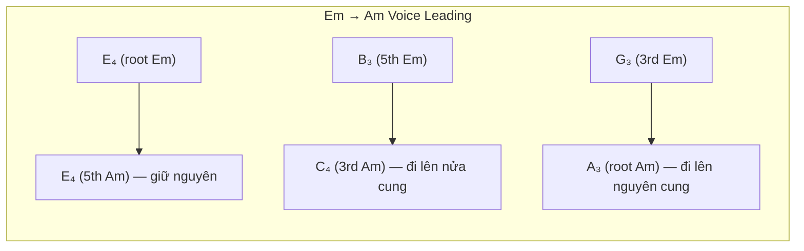
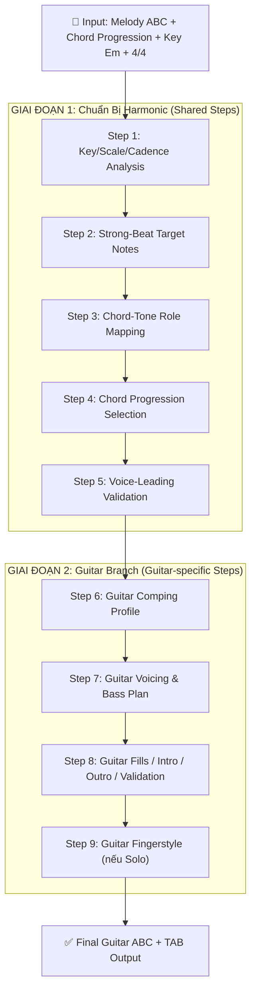

# Lý Thuyết Rải Hợp Âm Guitar & Quy Trình Xây Dựng Đệm Hát

## Ngữ cảnh: Bài Hari Bol — K:Em, M:4/4

> [!NOTE]
> Tài liệu này nghiên cứu lý thuyết rải hợp âm (arpeggiation) cho Guitar và quy trình xây dựng bài phối đệm hát (accompaniment) chỉ riêng cho Guitar, áp dụng vào bài Hari Bol với giả định: **Key: Em**, **Time Signature: 4/4**, và Chord Progression đã xác định.

---

## Phần I: Lý Thuyết Rải Hợp Âm Guitar (Arpeggiation Theory)

### 1. Rải hợp âm là gì?

**Rải hợp âm (Arpeggiation)** = thay vì đánh đồng thời tất cả các nốt của hợp âm (block chord / strumming), ta **lần lượt gẩy từng nốt** theo một trật tự nhất định. Điều này tạo ra:

- **Sự chuyển động nội tại (inner motion)** — nghe phong phú hơn block chord
- **Không gian cho giai điệu (melody space)** — ít "tranh" với ca sĩ hơn
- **Tạo "hơi thở" cho bài hát** — phù hợp nhạc thiền, bhajan, ballad

### 2. Các mẫu rải hợp âm cơ bản (Arpeggio Patterns)

#### 2.1 Hệ thống PIMA (Classical Fingerpicking)

Tay phải guitar chia thành các ngón chuyên biệt:

| Ngón | Ký hiệu | Dây phụ trách | Vai trò |
|------|---------|--------------|---------|
| **P (Pulgar / Thumb)** | P | Dây 6, 5, 4 (bass) | Nền tảng hòa âm, bass root/fifth |
| **I (Índice / Index)** | I | Dây 3 | Inner voice |
| **M (Medio / Middle)** | M | Dây 2 | Inner voice |
| **A (Anular / Ring)** | A | Dây 1 (treble) | Melody / highest voice |

#### 2.2 Các Pattern Rải Cơ Bản (cho nhịp 4/4, L:1/8 = 8 phách con/ô nhịp)

````carousel
**Pattern 1: P-I-M-A-M-I (Ascending-Descending / "Cánh quạt")**

```text
Beat:  1   &   2   &   3   &   4   &
Ngón:  P   I   M   A   M   I   P   I
Dây:   6   3   2   1   2   3   5   3

Đặc điểm: Êm dịu, chảy đều, phù hợp ballad/bhajan
Ví dụ Em: E₂  G₃  B₃  E₄  B₃  G₃  B₂  G₃
```
<!-- slide -->
**Pattern 2: P-I-M-A (Ascending Only / "Leo thang")**

```text
Beat:  1   &   2   &   3   &   4   &
Ngón:  P   I   M   A   P   I   M   A
Dây:   6   3   2   1   5   3   2   1

Đặc điểm: Tiến về phía trước, tạo động lực
Ví dụ Em: E₂  G₃  B₃  E₄  B₂  G₃  B₃  E₄
```
<!-- slide -->
**Pattern 3: Travis Picking (Alternating Bass)**

```text
Beat:  1   &   2   &   3   &   4   &
Ngón:  P   I   P   M   P   I   P   M
Dây:   6   2   4   1   5   2   4   1

Đặc điểm: Bass xen kẽ Root→5th, ngón fingers fill ở giữa
Ví dụ Em: E₂  B₃  D₃  E₄  B₂  B₃  D₃  E₄
```
<!-- slide -->
**Pattern 4: Pinch + Arpeggio (Devotional Bhajan Pattern)**

```text
Beat:  1      &   2   &   3      &   4   &
Ngón:  P+A    I   M   I   P+A    I   M   I
Dây:   6+1    3   2   3   5+1    3   2   3

Đặc điểm: Kẹp (pinch) bass+treble cùng lúc ở beat mạnh
          → tạo "anchor" vững, rồi rải nốt giữa
Ví dụ Em: E₂+E₄  G₃  B₃  G₃  B₂+E₄  G₃  B₃  G₃
```
````

### 3. Quy tắc chọn Pattern phù hợp

| Tính chất bài | Pattern khuyên dùng | Lý do |
|--------------|---------------------|-------|
| **Chậm, thiền, bhajan** | Pinch + Arpeggio hoặc P-I-M-A-M-I | Êm, không gấp, có anchor |
| **Folk, ballad** | Travis Picking | Bass đều tạo "nhịp đập tim" |
| **Pop, uptempo** | Strumming (Down-Down-Up-Up-Down-Up) | Năng lượng, drive |
| **Rock, mạnh** | Power chord strum + muted 16th | Percussive, impact |

### 4. Quy tắc Bass khi rải hợp âm

> [!IMPORTANT]
> **Bass Line Protocol — Luật bất di bất dịch:**
> 1. **Beat 1 → Root** (nốt gốc của hợp âm) — luôn luôn
> 2. **Beat 3 → 5th** hoặc Root lại — tạo chuyển động harmonic
> 3. **Beat 4 (cuối ô nhịp) → Approach note** — nốt dẫn (bước đi nửa cung hoặc nguyên cung) về Root của hợp âm kế tiếp

Ví dụ chuyển Em → Am:

```text
Em:       Beat 1   Beat 2   Beat 3   Beat 4
Bass:     E₂(root) -arp-    B₂(5th)  G₂(approach→A)

Am:       Beat 1   Beat 2   Beat 3   Beat 4
Bass:     A₂(root) -arp-    E₃(5th)  G₂(approach→...)
```

### 5. Lý thuyết Voice Leading trong rải hợp âm Guitar

Khi chuyển từ hợp âm này sang hợp âm khác, các nốt cần tuân thủ **Luật Đường Ngắn Nhất (Law of Shortest Path)**:



**3 nguyên tắc:**
1. **Nốt chung (common tone)** → giữ nguyên vị trí, KHÔNG di chuyển
2. **Nốt khác** → di chuyển bước ngắn nhất (nửa cung hoặc nguyên cung)
3. **Tránh nhảy quãng lớn** ở các voice trung gian (inner voices)

---

## Phần II: Quy Trình Xây Dựng Bài Đệm Guitar cho Hari Bol

### Tổng quan Pipeline



### GIAI ĐOẠN 1: Chuẩn Bị Harmonic Foundation (5 Shared Steps)

Đây là 5 bước **chung cho tất cả nhạc cụ**, phải hoàn thành trước khi bắt đầu bất kỳ nhạc cụ nào:

---

#### Step 1: Key, Scale & Cadence Analysis (`key-scale-cadence`)

**Mục tiêu:** Xác nhận key, scale, và các điểm cadence.

Với Hari Bol:
- **Key:** Em (E minor, 1 dấu thăng: F#)
- **Scale:** E Natural Minor: E – F# – G – A – B – C – D
- **Relative Major:** G Major
- **Diatonic Chords trong Em:**

| Bậc | Hợp âm | Loại | Chức năng |
|-----|--------|------|-----------|
| i | Em | Minor | Tonic |
| ii° | F#dim | Diminished | Subdominant |
| III | G | Major | Tonic (relative) |
| iv | Am | Minor | Subdominant |
| v | Bm | Minor | Dominant (yếu) |
| VI | C | Major | Subdominant |
| VII | D | Major | Dominant (subtonic) |

- **Cadence targets:** Thường kết thúc phrase bằng `Am → Em` (iv→i) hoặc `D → Em` (VII→i) hoặc `Bm → Em` (v→i)

---

#### Step 2: Strong-Beat Target Notes (`strong-beat-targets`)

**Mục tiêu:** Xác định nốt giai điệu quan trọng ở beat mạnh.

Trong nhịp 4/4:
- **Beat 1 (⬤ rất mạnh):** Nốt melody ở đây phải là **chord tone** (root, 3rd, 5th)
- **Beat 3 (● mạnh vừa):** Cũng nên là chord tone
- **Beat 2, 4 (* nhẹ):** Có thể là passing tone, neighbor tone, suspension

Ví dụ phân tích 1 ô nhịp giai điệu Hari Bol (giả định):

```text
Ô nhịp 1:   E₄(beat 1) - F#₄(beat 2) - G₄(beat 3) - A₄(beat 4)
             ⬤ strong    * weak       ● medium      * weak
             → chord tone → passing   → chord tone  → passing
```

---

#### Step 3: Chord-Tone Role Mapping (`chord-tone-mapping`)

**Mục tiêu:** Map mỗi nốt giai điệu ở beat mạnh → vai trò trong hợp âm.

| Nốt melody | Vai trò có thể | Hợp âm phù hợp |
|-----------|----------------|----------------|
| E₄ | Root của Em, 5th của Am | Em, Am |
| G₄ | 3rd của Em, Root của G | Em, G |
| B₄ | 5th của Em, Root của Bm | Em, Bm |
| A₄ | Root của Am, 4th của Em (sus4) | Am |
| D₄ | Root của D, 7th của Em | D, Em7 |
| C₄ | Root của C, 3rd (minor) thấp của Am | C, Am |

---

#### Step 4: Chord Progression Selection (`chord-progression`)

**Mục tiêu:** Chọn chord progression phù hợp cho bài bhajan.

Các ứng viên phổ biến cho bhajan Em:

| # | Progression | Roman Numeral | Tính chất |
|---|------------|--------------|-----------|
| 1 | Em - Am - D - Em | i - iv - VII - i | Cổ điển bhajan, đơn giản, devotional |
| 2 | Em - G - Am - D | i - III - iv - VII | Mở rộng hơn, có chút pop |
| 3 | Em - C - G - D | i - VI - III - VII | Sáng hơn, năng lượng |
| 4 | Em - D - C - Bm | i - VII - VI - v | Andalusian-inspired, dramatic |

> [!TIP]
> Cho bhajan devotional, **Candidate 1** (`Em → Am → D → Em`) thường là lựa chọn tốt nhất: đơn giản, meditative, và tất cả hợp âm đều dùng được open voicing trên guitar.

---

#### Step 5: Voice-Leading Validation (`voice-leading-validation`)

**Mục tiêu:** Kiểm tra và điều chỉnh voice leading giữa các hợp âm.

Giả sử chọn `Em → Am → D → Em`:

```text
Chuyển Em → Am:
  E → E (common tone, giữ)
  B → C (đi lên nửa cung ✅)
  G → A (đi lên nguyên cung ✅)

Chuyển Am → D:
  A → A (common tone, giữ)
  E → D (đi xuống nguyên cung ✅)
  C → D (đi lên nguyên cung ✅)

Chuyển D → Em:
  D → E (đi lên nguyên cung ✅)
  A → B (đi lên nguyên cung ✅)
  F# → G (đi lên nửa cung ✅)
```

✅ Không có parallel 5ths/octaves. Voice leading hợp lệ.

---

### GIAI ĐOẠN 2: Guitar Branch (4 Guitar-specific Steps)

Sau khi đã có harmonic foundation, bắt đầu quy trình **chỉ dành cho Guitar**:

---

#### Step 6: Guitar Comping Profile (`guitar-comping-profile`)

**Mục tiêu:** Chọn kiểu đệm guitar phù hợp.

Hai ứng viên bắt buộc phải đề xuất:

````carousel
**Option A: Fingerpicked Arpeggiation (Devotional / Ballad)**

```abc
%%MIDI program 24
V:Guitar clef=treble-8 name="Guitar"
K:Em
L:1/8
M:4/4
% Arpeggio: P-I-M-A-M-I pattern, alternating bass
"Em"E,BGB eBGe | "Am"A,CEA ECEA, | "D"D,ADF ADFA, | "Em"E,BGB eBGe |
```

- **Mật độ:** Thưa → 8 nốt/ô nhịp (8th notes)
- **Phù hợp:** Bhajan chậm, devotional, meditation
- **Bass:** Alternating Root → 5th
- **Melody avoidance:** Guitar ở register thấp-trung, tránh va chạm
<!-- slide -->
**Option B: Heavy Downbeat Strumming**

```abc
%%MIDI program 24
V:Guitar clef=treble-8 name="Guitar"
K:Em
L:1/8
M:4/4
% Strum: Down-Down-Up-Up-Down-Up
"Em"[E,B,EGB]2 [E,B,EGB] z [E,B,EGB][E,B,EGB] | "Am"[A,CEA]2 [A,CEA] z [A,CEA][A,CEA] |
```

- **Mật độ:** Dày → full chord mỗi strum
- **Phù hợp:** Bhajan sôi động, call-and-response mạnh
- **Bass:** Tất cả dây cùng lúc
- **Melody avoidance:** Cần duy trì volume melody > guitar
````

> [!IMPORTANT]
> Với Hari Bol (giả sử nhịp chậm, devotional), **Option A: Fingerpicked Arpeggiation** thường phù hợp hơn.

---

#### Step 7: Guitar Voicing & Bass Plan (`guitar-voicing-bass`)

**Mục tiêu:** Lên kế hoạch voicing cụ thể và bass line cho từng hợp âm.

##### 7.1 Open Voicing Map (Standard Tuning, Em)

| Hợp âm | Voicing (dây 6→1) | Fret | Bass Root | Bass 5th |
|--------|-------------------|------|-----------|----------|
| **Em** | 0-2-2-0-0-0 | Open | E₂ (dây 6, fret 0) | B₂ (dây 5, fret 2) |
| **Am** | x-0-2-2-1-0 | Open | A₂ (dây 5, fret 0) | E₃ (dây 4, fret 2) |
| **D** | x-x-0-2-3-2 | Open | D₃ (dây 4, fret 0) | A₃ (dây 3, fret 2) |
| **G** | 3-2-0-0-0-3 | Open | G₂ (dây 6, fret 3) | D₃ (dây 4, fret 0) |
| **C** | x-3-2-0-1-0 | Open | C₃ (dây 5, fret 3) | G₃ (dây 3, fret 0) |
| **Bm** | x-2-4-4-3-2 | Barre | B₂ (dây 5, fret 2) | F#₃ (dây 4, fret 4) |

##### 7.2 Bass Plan (Alternating Bass + Walking Bass Transitions)

```text
Ô nhịp:   |   Em              |   Am              |   D               |   Em              |
Beat:        1    2    3    4      1    2    3    4      1    2    3    4      1    2    3    4
Bass:       E₂  -arp- B₂  G₂→   A₂  -arp- E₃  D₃→   D₃  -arp- A₃  B₂→   E₂  -arp- B₂   -

Giải thích:
  Beat 1: Root (nốt gốc) — LUÔN LUÔN
  Beat 3: 5th (quãng 5)
  Beat 4: Walking approach note → dẫn về root hợp âm kế
    • Em→Am: G₂ (ascending step to A₂)
    • Am→D:  D₃ (3rd of Am, descending step to D₃)
    • D→Em:  B₂ (approach from below to E... hoặc D#₂ chromatic)
```

##### 7.3 Guide Tone Strategy

> **Guide tones** = quãng 3 và quãng 7 của mỗi hợp âm. Đây là các nốt xác định "tính chất" hợp âm (major hay minor).

| Hợp âm | 3rd (guide tone 1) | 7th (guide tone 2, nếu dùng) |
|--------|--------------------|-----------------------------|
| Em | G₃ | D₄ (Em7) |
| Am | C₄ | G₃ (Am7) |
| D | F#₃ | C₄ (D7) |

→ Khi rải hợp âm, **ưu tiên gẩy qua các guide tone** trước khi gẩy root/5th lặp lại.

---

#### Step 8: Guitar Fills / Intro / Interlude / Outro / Validation (`guitar-fills-validation`)

**Mục tiêu:** Thêm fills, intro, outro, và validate playability.

##### 8.1 Fill Policy (Nốt chêm)

| Khi nào fill | Cách fill | Ví dụ |
|-------------|----------|-------|
| Giai điệu nghỉ (rest) | Neighbor tones hoặc chord tones | Melody nghỉ → guitar gẩy G→A→B rồi quay lại |
| Giai điệu giữ nốt dài | Bass walks nhẹ nhàng | Melody giữ E₄ → bass đi E₂→F#₂→G₂→A₂ |
| Giữa 2 phrase | Turnaround nhỏ | Kết phrase → fill D→C→B→E |

> [!CAUTION]
> **KHÔNG BAO GIỜ fill khi melody đang hát!** Guitar phải **yield** (nhường) khi giai điệu đang active. Fills chỉ xuất hiện ở khoảng trống.

##### 8.2 Intro Plan

```text
Intro (1-2 ô nhịp trước khi ca sĩ vào):
  Ô 1: Em arpeggio đơn giản — E₂, B₃, E₄, B₃ (thiết lập key)
  Ô 2: Em → D transition — E₂, G₃, B₃, D₄ → A₃ → F#₃ (dẫn vào bài)
```

##### 8.3 Outro Plan

```text
Outro (1-2 ô nhịp sau khi ca sĩ kết thúc):
  Ô cuối: D → Em cadence arpeggio
  Nốt cuối: E₂ + E₄ (pinch) — tonic octave, kết bài
```

##### 8.4 Physical Playability Validation

| Kiểm tra | Quy tắc | Kết quả |
|---------|---------|---------|
| ✅ Fret stretch | ≤ 4-5 frets | Em/Am/D/G/C đều open → OK |
| ✅ String assignment | 1 nốt/1 dây | Arpeggio → 1 nốt/lúc → OK |
| ✅ Left hand count | ≤ 4 ngón fretted | Em: 2, Am: 3, D: 3 → OK |
| ✅ Beat count | 8 unit beats/measure | 8 eighth notes → OK |
| ✅ Register conflict | Guitar < Melody register | Guitar ở octave 2-3, Melody ở octave 4-5 → OK |

---

#### Step 9: Guitar Fingerstyle (chỉ nếu Solo mode) (`guitar-fingerstyle`)

> [!NOTE]
> Step này chỉ áp dụng khi chọn **Solo/Fingerstyle** mode — guitar tự mang giai điệu, bass, và hợp âm trên cùng 1 cây đàn. Nếu đệm hát (accompaniment), dừng ở Step 8.

Nếu chọn Fingerstyle, áp dụng **Downward Compression Algorithm**:

```text
Phase 2: Nén xuống 1 cây guitar

Dây 1-3 (treble): Melody
  → Giai điệu Hari Bol được route lên dây 1, 2, 3

Dây 4-6 (bass): Bass Root/5th
  → Bass alternating pattern E₂-B₂ (dây 6-5)

Dây giữa (3-4): Inner voices
  → Guide tones (3rd, 7th) fill vào beat 2, 4

Kết quả: Cả giai điệu + bass + hợp âm trên 1 guitar
```

---

## Phần III: Ví Dụ Tổng Hợp — Hari Bol Guitar Accompaniment (ABC)

### Ví dụ đệm hát (Accompaniment Mode) — 4 ô nhịp đầu

```abc
%abc-2.1
X:1
T:Hari Bol — Guitar Accompaniment Demo
M:4/4
L:1/8
Q:1/4=80
%%MIDI program 24
K:Em
%
% Pattern: Devotional Pinch + Arpeggio
% Beat:  1     &    2    &    3     &    4    &
%
% Ô 1: Em
"Em"[E,e]B, G B  [B,e]G B G |
% Ô 2: Am
"Am"[A,e]C E A  [E,e]C E A |
% Ô 3: D
"D"[D,d]A, =F A  [A,d]=F A =F |
% Ô 4: Em (cadence return)
"Em"[E,e]B, G B  [B,e]G B e |
```

### Phân tích ô nhịp 1 (Em):

```text
Beat 1: Pinch E₂+E₄ (root octave — thiết lập hợp âm)
   &  : B₂ (5th, bass movement)
Beat 2: G₃ (3rd — guide tone, xác định minor)
   &  : B₃ (5th)
Beat 3: Pinch B₂+E₄ (5th+root — anchor thứ 2)
   &  : G₃ (3rd lặp lại)
Beat 4: B₃ (5th)
   &  : G₃ (3rd, chuẩn bị chuyển)
```

---

## Phần IV: Tóm Tắt Quy Trình (Checklist)

```text
□ 1. Xác nhận Key, Scale, Cadence (Em, E natural minor)
□ 2. Phân tích Strong-Beat notes trong melody
□ 3. Map melody notes → chord tone roles
□ 4. Chọn Chord Progression (Em-Am-D-Em)
□ 5. Validate Voice Leading giữa các hợp âm
  ────── Xong Shared Steps ──────
□ 6. Chọn Guitar Comping Profile (Arpeggio / Strum)
□ 7. Lên Voicing Map + Bass Plan (open voicing, alternating bass)
□ 8. Thêm Fills, Intro, Outro + Validate playability
□ 9. [Nếu Solo] Nén Fingerstyle (Melody + Bass + Chords trên 1 guitar)
  ────── Xong Guitar Branch ──────
□ 10. Output: Final Guitar ABC + TAB
```

---

## Phần V: Tham Chiếu Kiến Trúc trong App

Quy trình trên được implement qua các workflow steps trong app:

| Step | Code Reference | File |
|------|---------------|------|
| Shared Steps 1-5 | `ACCOMPANIMENT_WORKFLOW_SHARED_STEP_IDS` | [definition.ts](file:///Users/steve/duyhunghd6/bhajan-song-composer/src/lib/theory/accompaniment-workflow/definition.ts#L3-L9) |
| Guitar Steps 6-9 | `ACCOMPANIMENT_WORKFLOW_GUITAR_STEP_IDS` | [definition.ts](file:///Users/steve/duyhunghd6/bhajan-song-composer/src/lib/theory/accompaniment-workflow/definition.ts#L11-L16) |
| Guitar Theory | Arrangement Module: Guitar | [ARRANGEMENT01-GUITAR.md](file:///Users/steve/duyhunghd6/bhajan-song-composer/.agents/skills/music-theory-arrangement/ARRANGEMENT01-GUITAR.md) |
| Music Theory | Comprehensive Theory Foundation | [THEORY.md](file:///Users/steve/duyhunghd6/bhajan-song-composer/.agents/skills/music-theory-arrangement/THEORY.md) |
| Accompaniment UI | AccompanimentStep Component | [AccompanimentStep.tsx](file:///Users/steve/duyhunghd6/bhajan-song-composer/src/components/composer/workspace/AccompanimentStep.tsx) |
| Wizard Controller | AccompanimentWorkflowWizard | [AccompanimentWorkflowWizard.tsx](file:///Users/steve/duyhunghd6/bhajan-song-composer/src/components/composer/AccompanimentWorkflowWizard.tsx) |
