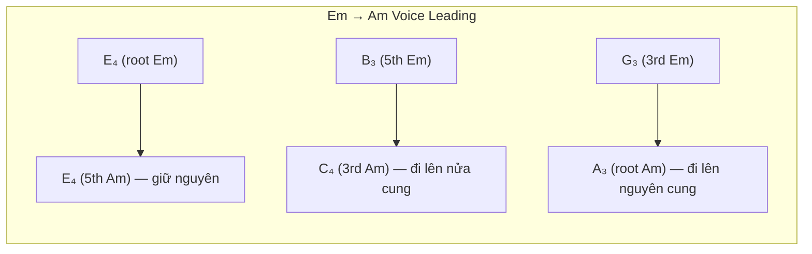

# Lý Thuyết Rải Hợp Âm Guitar (Arpeggiation Theory)
<!-- beads-id: br-guide-guitar-accompaniment -->

> Tài liệu này là **lý thuyết thuần** (tiếng Việt) về rải hợp âm guitar, ví dụ ABC minh hoạ và hệ thống Chord-Tone Reference. Quy trình workflow từng bước của app (Steps 1–6, code references) nằm ở [Accompaniment Workflow Guide](../guides/accompaniment-workflow.md); nhánh solo Guitar Fingerstyle nằm ở [Guitar Fingerstyle Arrangement Guide](../guides/guitar-fingerstyle-arrangement-guide.md).
> Mô hình nghiệp vụ chung cho đệm hát Guitar/Piano—timeline hòa thanh, điệu đệm và voicing—nằm ở [Singer-Accompaniment Decision Model](../guides/singer-accompaniment-decision-model.md). Ví dụ Hari Bol bên dưới chỉ là 4/4, không phải catalog điệu cho mọi nhịp.

## Ngữ cảnh: Bài Hari Bol — K:Em, M:4/4
<!-- beads-id: br-guide-guitar-accompaniment-s01 -->

> [!NOTE]
> Tài liệu này nghiên cứu lý thuyết rải hợp âm (arpeggiation) cho Guitar và quy trình xây dựng bài phối đệm hát (accompaniment) chỉ riêng cho Guitar, áp dụng vào bài Hari Bol với giả định: **Key: Em**, **Time Signature: 4/4**, và Chord Progression đã xác định.

---

## Phần I: Lý Thuyết Rải Hợp Âm Guitar (Arpeggiation Theory)
<!-- beads-id: br-guide-guitar-accompaniment-s02 -->

### 1. Rải hợp âm là gì?
<!-- beads-id: br-guide-guitar-accompaniment-s03 -->

**Rải hợp âm (Arpeggiation)** = thay vì đánh đồng thời tất cả các nốt của hợp âm (block chord / strumming), ta **lần lượt gẩy từng nốt** theo một trật tự nhất định. Điều này tạo ra:

- **Sự chuyển động nội tại (inner motion)** — nghe phong phú hơn block chord
- **Không gian cho giai điệu (melody space)** — ít "tranh" với ca sĩ hơn
- **Tạo "hơi thở" cho bài hát** — phù hợp nhạc thiền, bhajan, ballad

### 2. Các mẫu rải hợp âm cơ bản (Arpeggio Patterns)
<!-- beads-id: br-guide-guitar-accompaniment-s04 -->

#### 2.1 Hệ thống PIMA (Classical Fingerpicking)
<!-- beads-id: br-guide-guitar-accompaniment-s05 -->

Tay phải guitar chia thành các ngón chuyên biệt:

| Ngón | Ký hiệu | Dây phụ trách | Vai trò |
|------|---------|--------------|---------|
| **P (Pulgar / Thumb)** | P | Dây 6, 5, 4 (bass) | Nền tảng hòa âm, bass root/fifth |
| **I (Índice / Index)** | I | Dây 3 | Inner voice |
| **M (Medio / Middle)** | M | Dây 2 | Inner voice |
| **A (Anular / Ring)** | A | Dây 1 (treble) | Melody / highest voice |

#### 2.2 Các Pattern Rải Cơ Bản (cho nhịp 4/4, L:1/8 = 8 phách con/ô nhịp)
<!-- beads-id: br-guide-guitar-accompaniment-s06 -->

````carousel
**Pattern 1: P-I-M-A-M-I (Ascending-Descending / "Cánh quạt")**

```text
Beat:  1   &   2   &   3   &   4   &
Ngón:  P   I   M   A   M   I   P   I
Dây:   6   3   2   1   2   3   5   3

Đặc điểm: Êm dịu, chảy đều, phù hợp ballad/bhajan
Ví dụ Em: E₂  G₃  B₃  E₄  B₃  G₃  B₂  G₃
```
<!-- slide -->
**Pattern 2: P-I-M-A (Ascending Only / "Leo thang")**

```text
Beat:  1   &   2   &   3   &   4   &
Ngón:  P   I   M   A   P   I   M   A
Dây:   6   3   2   1   5   3   2   1

Đặc điểm: Tiến về phía trước, tạo động lực
Ví dụ Em: E₂  G₃  B₃  E₄  B₂  G₃  B₃  E₄
```
<!-- slide -->
**Pattern 3: Travis Picking (Alternating Bass)**

```text
Beat:  1   &   2   &   3   &   4   &
Ngón:  P   I   P   M   P   I   P   M
Dây:   6   2   4   1   5   2   4   1

Đặc điểm: Bass xen kẽ Root→5th, ngón fingers fill ở giữa
Ví dụ Em: E₂  B₃  D₃  E₄  B₂  B₃  D₃  E₄
```
<!-- slide -->
**Pattern 4: Pinch + Arpeggio (Devotional Bhajan Pattern)**

```text
Beat:  1      &   2   &   3      &   4   &
Ngón:  P+A    I   M   I   P+A    I   M   I
Dây:   6+1    3   2   3   5+1    3   2   3

Đặc điểm: Kẹp (pinch) bass+treble cùng lúc ở beat mạnh
          → tạo "anchor" vững, rồi rải nốt giữa
Ví dụ Em: E₂+E₄  G₃  B₃  G₃  B₂+E₄  G₃  B₃  G₃
```
````

### 2.3 Chính sách Guitar Classic hỗ trợ ca sĩ
<!-- beads-id: br-guide-guitar-accompaniment-s07 -->

Đây là chính sách cho nhánh **Guitar Classic Accompaniment**, không phải solo Guitar Fingerstyle.

| Thành phần | Vai trò | Tỷ trọng mục tiêu |
|---|---|---:|
| Dây 6–5–4 | Root, fifth, bass approach (`p`) | 30–45% individual-note attacks |
| Dây 3–2–1 | Arpeggio, guide tone, color (`i–m–a`) | 55–70% individual-note attacks |
| Bass liên tiếp | Chỉ cho transition/cadence | Tối đa 2 bass-only onsets thông thường |
| Pinch | Một bass + một treble cùng lúc | Chỉ ở metric strong beat |

- Một pinch tính một bass attack và một treble attack. Tỷ trọng được xét trên toàn bộ support voice đã realized, không reset ở từng ô nhịp hoặc chord window ngắn.
- Với đoạn rất ngắn, tỷ lệ nguyên không thể khớp tuyệt đối; scheduler vẫn nhắm mốc bass 37.5% thay vì lặp bass pattern.
- Walking bass là **tùy chọn**: chỉ dùng ngay trước chord change thực, theo bước ngắn, ở subdivision yếu khi có thể. Không bắt buộc beat 4 của mọi ô nhịp.
- Trong split bar, mỗi chord window kết thúc/rearticulate texture cũ và bắt đầu context root/voicing của chord mới. Không để harmony cũ sustain xuyên qua chord mới trừ common tone chủ ý còn hợp lệ.
- Pinch không phải block chord: phải có ít nhất một dây 4–6 và một dây 1–3 khác nhau. Nếu window không có strong step, dùng arpeggio thường.

### 3. Quy tắc chọn Pattern phù hợp
<!-- beads-id: br-guide-guitar-accompaniment-s08 -->

| Tính chất bài | Pattern khuyên dùng | Lý do |
|--------------|---------------------|-------|
| **Chậm, thiền, bhajan** | Pinch + Arpeggio hoặc P-I-M-A-M-I | Êm, không gấp, có anchor |
| **Folk, ballad** | Travis Picking | Bass đều tạo "nhịp đập tim" |
| **Pop, uptempo** | Strumming (Down-Down-Up-Up-Down-Up) | Năng lượng, drive |
| **Rock, mạnh** | Power chord strum + muted 16th | Percussive, impact |

### 4. Quy tắc Bass khi rải hợp âm
<!-- beads-id: br-guide-guitar-accompaniment-s09 -->

> [!IMPORTANT]
> **Bass Line Protocol — nền đệm ca sĩ có kiểm soát:**
> 1. **Đầu mỗi chord window → Root** — anchor cho harmony mới.
> 2. **Beat ổn định tiếp theo → Root hoặc 5th khi cần** — chỉ khi vẫn giữ được texture treble-led.
> 3. **Subdivision yếu cuối window → optional approach note** — chỉ trước chord change thực, theo bước ngắn và không làm thành bass ostinato.
> 4. **Không quá hai bass-only onsets liên tiếp** ngoài exception transition/cadence có chủ ý.

Ví dụ chuyển Em → Am:

```text
Em:       Beat 1   Beat 2   Beat 3   Beat 4
Bass:     E₂(root) -arp-    B₂(5th)  G₂(approach→A)

Am:       Beat 1   Beat 2   Beat 3   Beat 4
Bass:     A₂(root) -arp-    E₃(5th)  G₂(approach→...)
```

### 5. Lý thuyết Voice Leading trong rải hợp âm Guitar
<!-- beads-id: br-guide-guitar-accompaniment-s10 -->

Khi chuyển từ hợp âm này sang hợp âm khác, các nốt cần tuân thủ **Luật Đường Ngắn Nhất (Law of Shortest Path)**:



**3 nguyên tắc:**
1. **Nốt chung (common tone)** → giữ nguyên vị trí, KHÔNG di chuyển
2. **Nốt khác** → di chuyển bước ngắn nhất (nửa cung hoặc nguyên cung)
3. **Tránh nhảy quãng lớn** ở các voice trung gian (inner voices)

---

## Phần III: Ví Dụ Tổng Hợp — Hari Bol Guitar Accompaniment (ABC)
<!-- beads-id: br-guide-guitar-accompaniment-s32 -->

### Ví dụ đệm hát (Accompaniment Mode) — 4 ô nhịp đầu
<!-- beads-id: br-guide-guitar-accompaniment-s33 -->

```abc
%abc-2.1
X:1
T:Hari Bol — Guitar Accompaniment Demo
M:4/4
L:1/8
Q:1/4=80
%%MIDI program 24
K:Em
%
% Pattern: Devotional Pinch + Arpeggio
% Beat:  1     &    2    &    3     &    4    &
%
% Ô 1: Em
"Em"[E,e]B, G B  [B,e]G B G |
% Ô 2: Am
"Am"[A,e]C E A  [E,e]C E A |
% Ô 3: D
"D"[D,d]A, =F A  [A,d]=F A =F |
% Ô 4: Em (cadence return)
"Em"[E,e]B, G B  [B,e]G B e |
```

### Phân tích ô nhịp 1 (Em):
<!-- beads-id: br-guide-guitar-accompaniment-s34 -->

```text
Beat 1: Pinch E₂+E₄ (root octave — thiết lập hợp âm)
   &  : B₂ (5th, bass movement)
Beat 2: G₃ (3rd — guide tone, xác định minor)
   &  : B₃ (5th)
Beat 3: Pinch B₂+E₄ (5th+root — anchor thứ 2)
   &  : G₃ (3rd lặp lại)
Beat 4: B₃ (5th)
   &  : G₃ (3rd, chuẩn bị chuyển)
```

---

## Phần III-B: Ví Dụ Chi Tiết Từng Bước — Hari Bol (K:Em)
<!-- beads-id: br-guide-guitar-accompaniment-s48 -->

Các ví dụ dưới đây minh hoạ từng bước của quy trình accompaniment bằng bài Hari Bol. Quy trình chính thức (step id, gating, hợp đồng) nằm ở [Accompaniment Workflow Guide](../guides/accompaniment-workflow.md); phần này chỉ là ví dụ lý thuyết.

### 1.2 Strong-Beat Target Notes
<!-- beads-id: br-guide-guitar-accompaniment-s15 -->

**Mục tiêu:** Xác định nốt giai điệu quan trọng ở beat mạnh.

Trong nhịp 4/4:
- **Beat 1 (⬤ rất mạnh):** Nốt melody ở đây phải là **chord tone** (root, 3rd, 5th)
- **Beat 3 (● mạnh vừa):** Cũng nên là chord tone
- **Beat 2, 4 (* nhẹ):** Có thể là passing tone, neighbor tone, suspension

Ví dụ phân tích 1 ô nhịp giai điệu Hari Bol (giả định):

```text
Ô nhịp 1:   E₄(beat 1) - F#₄(beat 2) - G₄(beat 3) - A₄(beat 4)
             ⬤ strong    * weak       ● medium      * weak


```

### Step 2: Chord Roles & Progression (`chord-roles-progression`)
<!-- beads-id: br-guide-guitar-accompaniment-s16 -->

**Mục tiêu:** Map mỗi nốt giai điệu ở beat mạnh → vai trò trong hợp âm.

| Nốt melody | Vai trò có thể | Hợp âm phù hợp |
|-----------|----------------|----------------|
| E₄ | Root của Em, 5th của Am | Em, Am |
| G₄ | 3rd của Em, Root của G | Em, G |
| B₄ | 5th của Em, Root của Bm | Em, Bm |
| A₄ | Root của Am, 4th của Em (sus4) | Am |
| D₄ | Root của D, 7th của Em | D, Em7 |
| C₄ | Root của C, 3rd (minor) thấp của Am | C, Am |

### 2.2 Chord Progression Selection
<!-- beads-id: br-guide-guitar-accompaniment-s17 -->

**Mục tiêu:** Chọn chord progression phù hợp cho bài bhajan.

Các ứng viên phổ biến cho bhajan Em:

| # | Progression | Roman Numeral | Tính chất |
|---|------------|--------------|-----------|
| 1 | Em - Am - D - Em | i - iv - VII - i | Cổ điển bhajan, đơn giản, devotional |
| 2 | Em - G - Am - D | i - III - iv - VII | Mở rộng hơn, có chút pop |
| 3 | Em - C - G - D | i - VI - III - VII | Sáng hơn, năng lượng |
| 4 | Em - D - C - Bm | i - VII - VI - v | Andalusian-inspired, dramatic |

> [!TIP]


### Step 3: Voice-Leading Validation (`voice-leading-validation`)
<!-- beads-id: br-guide-guitar-accompaniment-s18 -->

**Mục tiêu:** Kiểm tra và điều chỉnh voice leading giữa các hợp âm.

Giả sử chọn `Em → Am → D → Em`:

```text
Chuyển Em → Am:
  E → E (common tone, giữ)
  B → C (đi lên nửa cung ✅)
  G → A (đi lên nguyên cung ✅)

Chuyển Am → D:
  A → A (common tone, giữ)
  E → D (đi xuống nguyên cung ✅)
  C → D (đi lên nguyên cung ✅)

Chuyển D → Em:
  D → E (đi lên nguyên cung ✅)
  A → B (đi lên nguyên cung ✅)
  F# → G (đi lên nửa cung ✅)
```

✅ Không có parallel 5ths/octaves. Voice leading hợp lệ.

---


### Step 4: Guitar Comping Profile (`guitar-comping-profile`)
<!-- beads-id: br-guide-guitar-accompaniment-s20 -->

**Mục tiêu:** Chọn kiểu đệm guitar phù hợp.

Hai ứng viên bắt buộc phải đề xuất:

````carousel
**Option A: Fingerpicked Arpeggiation (Devotional / Ballad)**

```abc
%%MIDI program 24
V:Guitar clef=treble-8 name="Guitar"
K:Em
L:1/8
M:4/4
% Arpeggio: P-I-M-A-M-I pattern, alternating bass
"Em"E,BGB eBGe | "Am"A,CEA ECEA, | "D"D,ADF ADFA, | "Em"E,BGB eBGe |
```

- **Mật độ:** Thưa → 8 nốt/ô nhịp (8th notes)
- **Phù hợp:** Bhajan chậm, devotional, meditation
- **Bass:** Alternating Root → 5th
- **Melody avoidance:** Guitar ở register thấp-trung, tránh va chạm
<!-- slide -->
**Option B: Heavy Downbeat Strumming**

```abc
%%MIDI program 24
V:Guitar clef=treble-8 name="Guitar"
K:Em
L:1/8
M:4/4
% Strum: Down-Down-Up-Up-Down-Up
"Em"[E,B,EGB]2 [E,B,EGB] z [E,B,EGB][E,B,EGB] | "Am"[A,CEA]2 [A,CEA] z [A,CEA][A,CEA] |
```

- **Mật độ:** Dày → full chord mỗi strum
- **Phù hợp:** Bhajan sôi động, call-and-response mạnh
- **Bass:** Tất cả dây cùng lúc
- **Melody avoidance:** Cần duy trì volume melody > guitar
````

> [!IMPORTANT]
> Với Hari Bol (giả sử nhịp chậm, devotional), **Option A: Fingerpicked Arpeggiation** thường phù hợp hơn.


### 5.2 Bass Plan (Alternating Bass + Walking Bass Transitions)
<!-- beads-id: br-guide-guitar-accompaniment-s23 -->

```text
Ô nhịp:   |   Em              |   Am              |   D               |   Em              |
Beat:        1    2    3    4      1    2    3    4      1    2    3    4      1    2    3    4
Bass:       E₂  -arp- B₂  G₂→   A₂  -arp- E₃  D₃→   D₃  -arp- A₃  B₂→   E₂  -arp- B₂   -

Giải thích:
  Beat 1: Root (nốt gốc) — LUÔN LUÔN
  Beat 3: 5th (quãng 5)
  Beat 4: Walking approach note → dẫn về root hợp âm kế
    • Em→Am: G₂ (ascending step to A₂)
    • Am→D:  D₃ (3rd of Am, descending step to D₃)
    • D→Em:  B₂ (approach from below to E... hoặc D#₂ chromatic)
```

### 5.3 Guide Tone Strategy
<!-- beads-id: br-guide-guitar-accompaniment-s24 -->

> **Guide tones** = quãng 3 và quãng 7 của mỗi hợp âm. Đây là các nốt xác định "tính chất" hợp âm (major hay minor).

| Hợp âm | 3rd (guide tone 1) | 7th (guide tone 2, nếu dùng) |
|--------|--------------------|-----------------------------|
| Em | G₃ | D₄ (Em7) |
| Am | C₄ | G₃ (Am7) |
| D | F#₃ | C₄ (D7) |

→ Khi rải hợp âm, **ưu tiên gẩy qua các guide tone** trước khi gẩy root/5th lặp lại.

### Ví dụ lý thuyết cho Guitar Fingerstyle (fill, intro/outro, playability)
<!-- beads-id: br-guide-guitar-accompaniment-s49 -->

> [!NOTE]
> Các ví dụ sau chỉ minh hoạ ý tưởng âm nhạc. Hợp đồng sản xuất của `/compose/:slug/guitar-fingerstyle` (TimeGrid, cửa sổ fill hợp lệ, giới hạn skill, staged LLM) là [Guitar Fingerstyle Arrangement Guide](../guides/guitar-fingerstyle-arrangement-guide.md).

#### Fill Policy (Nốt chêm)
<!-- beads-id: br-guide-guitar-accompaniment-s27 -->

| Khi nào fill | Cách fill | Ví dụ |
|-------------|----------|-------|
| Giai điệu nghỉ (rest) | Neighbor tones hoặc chord tones | Melody nghỉ → guitar gẩy G→A→B rồi quay lại |
| Giai điệu giữ nốt dài | Không thêm discretionary fill hoặc harmony attack/sustain | Giữ khoảng trống để melody tiếp tục nổi bật |
| Giữa 2 phrase | Turnaround nhỏ | Kết phrase → fill D→C→B→E |

> [!CAUTION]
> **KHÔNG BAO GIỜ fill khi melody đang hát!** Guitar phải **yield** (nhường) khi giai điệu đang active. Fills chỉ xuất hiện ở khoảng trống.

#### Intro Plan
<!-- beads-id: br-guide-guitar-accompaniment-s28 -->

```text
Intro (1-2 ô nhịp trước khi ca sĩ vào):
  Ô 1: Em arpeggio đơn giản — E₂, B₃, E₄, B₃ (thiết lập key)
  Ô 2: Em → D transition — E₂, G₃, B₃, D₄ → A₃ → F#₃ (dẫn vào bài)
```

#### Outro Plan
<!-- beads-id: br-guide-guitar-accompaniment-s29 -->

```text
Outro (1-2 ô nhịp sau khi ca sĩ kết thúc):
  Ô cuối: D → Em cadence arpeggio
  Nốt cuối: E₂ + E₄ (pinch) — tonic octave, kết bài
```

#### Physical Playability Validation
<!-- beads-id: br-guide-guitar-accompaniment-s30 -->

| Kiểm tra | Quy tắc | Kết quả |
|---------|---------|---------|
| ✅ Fret stretch | ≤ 4-5 frets | Em/Am/D/G/C đều open → OK |
| ✅ String assignment | 1 nốt/1 dây | Arpeggio → 1 nốt/lúc → OK |
| ✅ Left hand count | ≤ 4 ngón fretted | Em: 2, Am: 3, D: 3 → OK |
| ✅ Beat count | 8 unit beats/measure | 8 eighth notes → OK |
| ✅ Register conflict | Guitar < Melody register | Guitar ở octave 2-3, Melody ở octave 4-5 → OK |


#### Dedicated Guitar Fingerstyle Route
<!-- beads-id: br-guide-guitar-accompaniment-s31 -->

> [!NOTE]
> Phần này chỉ áp dụng tại `/compose/:slug/guitar-fingerstyle` — guitar tự mang giai điệu, bass, và hợp âm trên cùng 1 cây đàn. Đây không phải mode trong Accompaniment Wizard; Guitar Classic accompaniment kết thúc sau `guitar-classic-abc-notation` với một standard-notation support voice, không phải Fingerstyle artifact.

Trên dedicated route, áp dụng **Downward Compression Algorithm**:

```text
Phase 2: Nén xuống 1 cây guitar

Dây 1-3 (treble): Melody
  → Giai điệu Hari Bol được route lên dây 1, 2, 3

Dây 4-6 (bass): Bass Root/5th
  → Bass alternating pattern E₂-B₂ (dây 6-5)

Dây giữa (3-4): Inner voices
  → Guide tones (3rd, 7th) fill vào beat 2, 4

Kết quả: Cả giai điệu + bass + hợp âm trên 1 guitar
```


---

## Phần VI: Hệ Thống Chord-Tone Reference (Bảng Tham Chiếu Nốt Hợp Âm)
<!-- beads-id: br-guide-guitar-accompaniment-s37 -->

> [!NOTE]
> Phần này mô tả hệ thống tự động tạo bảng tham chiếu chord-tone cho LLM, đảm bảo mọi nốt guitar phải thuộc hợp âm được ghi chú trong melody. Module: `src/lib/theory/chord-tone-reference.ts`

### 1. Vấn đề: LLM tạo nốt sai hợp âm
<!-- beads-id: br-guide-guitar-accompaniment-s38 -->

Khi LLM tạo guitar arpeggio, 3 lỗi hệ thống thường xảy ra:

| Lỗi | Ví dụ | Nguyên nhân |
|-----|-------|-------------|
| **Sai accidental** | `^G` (G#) trong hợp âm Em dưới `K:G` | LLM không hiểu key signature ảnh hưởng thế nào đến ABC token |
| **Pattern đóng băng** | Lặp cùng 1 arpeggio E-G#-B cho tất cả ô nhịp | LLM copy-paste mẫu thay vì thay đổi theo chord |
| **Bỏ qua chord split** | Am→B7 trong 1 ô nhịp → dùng chỉ Am tones | LLM không nhận ra ô nhịp chia 2 hợp âm |

### 2. Giải pháp: Chord-Tone Reference Table
<!-- beads-id: br-guide-guitar-accompaniment-s39 -->

Hệ thống tự động trích xuất chord symbols từ ABC, phân giải từng chord thành các nốt cụ thể, và map sang ABC tokens dưới key signature hiện tại.

#### 2.1 Luồng xử lý
<!-- beads-id: br-guide-guitar-accompaniment-s40 -->

```mermaid
flowchart LR
    A["Source ABC\n(có chord annotations\n\"Em\", \"Am\", \"D\")"] --> B["extractChordSymbolsByMeasure()"]
    B --> C["resolveChordNotes()\nEm → E, G, B\nD → D, F#, A"]
    C --> D["noteToAbcToken()\nunder K:G"]
    D --> E["Chord-Tone\nReference Table\n(prompt text)"]
    E --> F["Injected vào\nLLM Prompt"]
```

#### 2.2 Ví dụ output cho Hari Bol (K:G)
<!-- beads-id: br-guide-guitar-accompaniment-s41 -->

```text
### Chord-Tone Reference Table (K:G)

CHORD-TONE ENFORCEMENT: Every Guitar voice note in every measure MUST be a member
of the chord annotated in the Melody for that measure.

| Chord | Notes   | ABC Tokens (octave 3-5)        | Key Signature Note                         |
|:------|:--------|:-------------------------------|:-------------------------------------------|
| Em    | E, G, B | E,, G,, B,, E, G, B, e, g, b  | all notes are natural in this key          |
| Am    | A, C, E | A,, C,, E,, A, C, E, a, c, e  | all notes are natural in this key          |
| D     | D, F#, A| D,, F,, A,, D, F, A, d, f, a  | F# is implied by key signature (no ^ needed) |
| C     | C, E, G | C,, E,, G,, C, E, G, c, e, g  | all notes are natural in this key          |
| B7    | B, D#, F#, A | B,, ^D,, F,, A,,…          | D# needs ^ accidental; F# is implied      |
```

#### 2.3 Quy tắc Key Signature cho ABC token
<!-- beads-id: br-guide-guitar-accompaniment-s43 -->

> [!IMPORTANT]
> **Quy tắc accidental dưới K:G (1 dấu thăng: F#):**
>
> | Nốt thực | ABC token cần viết | Giải thích |
> |----------|-------------------|------------|
> | F# | `F` (hoặc `f`) | F đã là F# theo key signature → KHÔNG cần `^` |
> | F natural | `=F` (hoặc `=f`) | Cần dấu natural `=` vì key sig mặc định sharp F |
> | G natural | `G` (hoặc `g`) | G là natural trong K:G → KHÔNG CẦN accidental |
> | G# | `^G` (hoặc `^g`) | Cần `^` vì G không bị sharp bởi key sig |
>
> **Lỗi thường gặp:** Viết `^G` khi muốn G natural trong Em → đây là G# = **SAI**

### 3. Validation: Kiểm tra Chord-Tone sau khi LLM tạo output
<!-- beads-id: br-guide-guitar-accompaniment-s44 -->

Hệ thống chạy `validateGuitarVoiceChordTones()` sau khi LLM tạo guitar ABC:

1. Trích xuất `[V:Guitar]` lines từ ABC
2. Trích xuất chord symbols từ `[V:Melody]` lines cùng ô nhịp
3. Với mỗi nốt Guitar → chuyển sang pitch class (có xét key signature)
4. Kiểm tra pitch class có thuộc tập chord tones của ô nhịp đó không
5. Nếu không → thêm warning (non-blocking) vào option

```text
Ví dụ warning output:
  [chord-tone] measure 3: Guitar note "^G" (pitch class 8) is not in chord Em (allowed: 4,7,11)
```

> [!TIP]
> Validation hiện tại ở mức **warning** (không blocking). LLM vẫn trả về kết quả nhưng user thấy warning và có thể yêu cầu regenerate. Trong tương lai có thể nâng lên blocking nếu tỷ lệ warning quá cao.


### 4. Vị trí injection trong prompt
<!-- beads-id: br-guide-guitar-accompaniment-s45 -->

Chord-Tone Reference Table được inject vào prompt ngay sau Source ABC và trước các chỉ dẫn output:

```text
Source ABC:
  ...melody with "Em", "Am", "D" chord annotations...

### Chord-Tone Reference Table (K:G)    ← inject ở đây
  ...table + per-measure mapping...

USER NOTE TO ADD TO PROMPT:
  ...
```

Nhánh Guitar Fingerstyle **không** dùng cơ chế inject ABC này: LLM chỉ nhận các hợp đồng staged bounded (`tablature:v1` → `fill-opportunities:v1` → `fill-selection:v1` → `fills:v1`) và server giữ TimeGrid nguồn là authority. Xem [Guitar Fingerstyle Arrangement Guide](../guides/guitar-fingerstyle-arrangement-guide.md).
